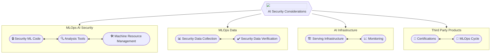

```mermaid
flowchart TD
    ESF{{<img src="https://navarro-bores.com/images/logo.jpg" width="30" height="30"> External Security Marco}}

    subgraph Unmanaged_Clients
        UC1([🔒 Zero trust endpoints])
    end

    subgraph API_Providers
        AP1([🌐 Secure connection configuration])
    end

    subgraph Applications_API_Consumption
        AAC1([🔧 Secure Configuration])
        AAC2([📱 Device Availability and Recovery])
    end

    subgraph Managed_Clients
        MC1([🛡️ EDP-based filtering protection])
        MC2([🛡️ Threat protection])
        MC3([🔄 Patch Management])
        MC4([🔒 DLP data in use])
        MC5([📲 MDM/MAM Security])
        MC6([🔧 Secure Config and Endpoint Lockdown])
        MC7([📧 Email and navigation control protection])
        MC8([📜 Certified Device])
    end

    subgraph Physical_Devices
        PD1([🔧 Secure Configuration])
        PD2([💻 Secure Platform])
        PD3([🆔 Device Identification])
        PD4([🔒 Data Protection])
        PD5([🔄 Software Update])
        PD6([📱 Device Availability and Recovery])
    end

    ESF --> Unmanaged_Clients
    ESF --> API_Providers
    ESF --> Applications_API_Consumption
    ESF --> Managed_Clients
    ESF --> Physical_Devices

    AAC1 <--> AAC2
    MC1 <--> MC2
    MC2 <--> MC3
    MC3 <--> MC4
    MC4 <--> MC5
    MC5 <--> MC6
    MC6 <--> MC7
    MC7 <--> MC8
    PD1 <--> PD2
    PD2 <--> PD3
    PD3 <--> PD4
    PD4 <--> PD5
    PD5 <--> PD6

```

```mermaid
flowchart TD
    MSF{{<img src="https://navarro-bores.com/images/logo.jpg" width="30" height="30"> Management of Security Marco}}

    subgraph Identity_Access_Management [Identity and Access Management]
        IAM1([🔒 Isolate Plane Management])
        IAM2([🛡️ Tier management protection])
        IAM3([🔑 Authorization Management])
        IAM4([📊 IAM Auditing, analysis, reporting])
        IAM5([👤 Identity Management])
        IAM6([🔐 Authentication Management])
        IAM7([🛡️ Privileged Access Management])
        IAM8([📲 Multi factor access])
        IAM9([🔒 Credential Management])
        IAM10([📜 Policy Management])
        IAM11([🔏 PKI Management])
        IAM12([🛡️ IAM & Access Services Availability & Recovery])
    end

    subgraph Monitoring_Management [Monitoring Management]
        MM1([🔧 Secure Configuration & Lockdown])
        MM2([⚠️ Scalation Management])
        MM3([🔍 Monitoring and assessment])
        MM4([🔗 Event Correlation])
        MM5([🛡️ SOC])
        MM6([📄 Log Audit])
        MM7([🔒 Penetration Security])
        MM8([🔍 Vulnerability Mgmt])
        MM9([📊 Technical audits])
        MM10([🔄 Security patch Mgmt])
        MM11([🛠️ Availability & Recovery Testing])
    end

    MSF --> Identity_Access_Management
    MSF --> Monitoring_Management

    IAM1 <--> IAM2
    IAM2 <--> IAM3
    IAM3 <--> IAM4
    IAM4 <--> IAM5
    IAM5 <--> IAM6
    IAM6 <--> IAM7
    IAM7 <--> IAM8
    IAM8 <--> IAM9
    IAM9 <--> IAM10
    IAM10 <--> IAM11
    IAM11 <--> IAM12

    MM1 <--> MM2
    MM2 <--> MM3
    MM3 <--> MM4
    MM4 <--> MM5
    MM5 <--> MM6
    MM6 <--> MM7
    MM7 <--> MM8
    MM8 <--> MM9
    MM9 <--> MM10
    MM10 <--> MM11

```

# Prólogo

* Ante la gravedad cada vez mayor de los ciberataques, en Tarlogic somos conscientes de la necesidad de ir un paso por delante. La emisión de un Marco de Seguridad  busca ofrecer los mecanismos que permitan garantizar la solidez en materia de ciberseguridad de nuestros clientes , a través del uso de controles en los dominios de Detección y Prevención.

* El Marco articula controles apropiados y desarrollados con objeto de proporcionar orientación sobre cómo debe evaluarse el nivel de madurez de seguridad de una solución. La adopción e implementación del Marco es un paso vital para garantizar que se puedan gestionar adecuadamente las amenazas de seguridad.

# Introducción
## Introducción al Marco

La sociedad digital actual exige una experiencia de cliente impecable, una disponibilidad continua y una sensación de protección de los servicios de los cuales son consumidores. Los activos de información y los servicios en línea ahora son estratégicamente importantes para todas las organizaciones públicas y privadas, así como para la sociedad en general.

Todo ello subraya la necesidad de salvaguardar los datos durante su tratamiento, almacenamiento y procesamiento proviniendo de la confidencialidad, integridad y disponibilidad de ellos, mientras mejora la resiliencia frente a las ciber-amenazas.

Por ello este Marco se constituye con objeto de:

- Mantener la protección de los activos de información y los servicios en línea
- Crear un enfoque común para abordar la ciberseguridad  dentro de la Organización.
- Alcanzar un nivel adecuado de madurez de los controles de seguridad.
- Garantizar que los riesgos de ciberseguridad se gestionen adecuadamente.

El Marco se utilizará para evaluar el nivel de madurez y la eficacia de los controles de seguridad en las distintas iniciativas, proyectos, compras, herramientas o soluciones.

Es de gran importancia entender que el Marco tiene como objeto establecer los controles y requisitos sobre un amplio conjunto de capacidades técnicas y capas de seguridad dadas dentro de una arquitectura o solución.

## Definición de Ciberseguridad

La ciberseguridad se define como el conjunto de herramientas, políticas, conceptos de seguridad, salvaguardas de seguridad, directrices, enfoques de gestión de riesgos, acciones, capacitación, mejores prácticas, aseguramiento y tecnologías que se puede utilizar para proteger los activos de información de la organización contra amenazas internas y externas.

Los objetivos generales de seguridad comprenden lo siguiente:

- **Confidencialidad**: los activos de información son accesibles sólo para aquellos autorizados a tener acceso (es decir, protegido contra la divulgación no autorizada o la filtración (no)intencionada de datos confidenciales).
- **Integridad**: los activos de información son precisos, completos y procesados correctamente (es decir, están protegidos contra modificación no autorizada, que puede incluir autenticidad y no repudio).
- **Disponibilidad**: los activos de información son resistentes y accesibles cuando sea necesario (es decir, están protegidos contra interrupción no autorizada).

## Guía de Lectura

Con objeto de favorecer el entendimiento del documento y su lectura, la información del Marco ha sido estructurada en dos bloques diferenciados:

- Estructura del Marco y funcionalidades
- Marco actual, donde recoge a fecha del documento las capas de seguridad, requerimientos, capacidades técnicas, controles, priorización y sus dominios.

# Estructura del Marco y funcionalidades

## Estructura

El Marco ha sido modelado con base únicamente técnica haciendo uso de los dominios técnicos de Ciberseguridad principales:

- *Security Architecture*
- *Application Security*
- *Marco and Standards*

La versión más actual del Marco hace uso de una estructura de cuatro niveles de profundidad y diecisiete capas de seguridad, para acomodar las ciento diez capacidades técnicas con sus principios, objetivos y controles.

- **Zones**: Cuatro zonas diferenciadas según ámbito:
	- *External Security*: Recoge las capas, capacidades, objetivos, requisitos y controles para los elementos que participan en la solución situados fuera del ámbito de la infraestructura física, virtual o lógica de la compañía.
	
	- *Infrastructure Security*: Recoge la capas, capacidades, objetivos, requisitos y controles para los elementos que se sitúan dentro de la infraestructura física, virtual o lógica de la compañía.
	
	- *Management of security*: De igual forma, recoge aquellas capas, capacidades, objetivos, requisitos y controles para aquellos elementos que introducen seguridad en la capa de gestión de identidad y acceso, o seguridad, haciendo uso principalmente de la monitorización y observación de los componentes que conforman la solución.
	
	- *AI Security Considerations*: Las consideraciones de seguridad sobre IA actúan de forma transversal sobre el resto de las tres capas anteriores, estableciendo los controles y principios en materia cibernética a cumplir.

- **Security Layers**: El uso de capas de seguridad en materia cibernética a veces es comparada con la seguridad que los fabricantes del sector aeronáutico establecen para evitar un accidente. De igual forma el uso de capas de seguridad permite evitar un incidente cibernético. La versión actual del Marco define 17 capas de seguridad según los niveles de profundidad de definición dentro de una solución, arquitectura de software (monolítica/microservicios) o infraestructura (IaaS, on-premise, PaaS, SaaS, híbrido).

	+ *Unmanaged Clients*
	+ *Managed Clients (Company Devices & BYOD)*
	+ *API Providers*
	+ *Applications API Consumption*
	+ *Physical Devices/Controllers (IoT)*
	+ *Boundary Security*
	+ *Network Security*
	+ *Server Security*
	+ *Containers Security*
	+ *Application Security*
	+ *Data & Cryptography Security*
	+ *Post-Quantum Cryptography Security*
	+ *Identity and Access Management*
	+ *Monitoring Management*
	+ *AI Security Considerations*

   **Cibersecurity Technical capabilities**: Las capacidades técnicas permiten facilitar los objetivos, requerimientos y controles en materia de Ciberseguridad que deberían existir en cada capa de seguridad. Estas capacidades técnicas son fácilmente trasladables a funcionalidades requeridas a nivel de arquitectura por cada componente, solución o diseño situado en el nivel de profundidad y/o exposición del mismo. Véase figura "1".

	+ *Objetivo*: Dentro de cada capacidad técnica, el objetivo describe el principal propósito y cuál es el conjunto de medidas en materia de ciberseguridad requeridas.
	+ *Requerimientos*: Reflejan los controles de ciberseguridad  obligatorios que deben considerarse.
	+ *Consideraciones* de control: Profundiza en los controles y requerimientos técnicos y apunta a guías de aplicación, guías técnicas, estándares, normas, políticas u otros documentos de interés.
	+ *Prioridad*: Normaliza en materia de ciberseguridad la criticidad de los controles sobre la capacidad técnica, siendo controles de requisitos: imprescindibles, críticos, altos, medios, bajos y recomendados.

   De acuerdo a la lectura del Marco, las capas de seguridad y sus controles son enumerados siguiendo la numeración con tipología:

<strong>MC1 - EPS2 . 023</strong>

<ul>
  <li>1 <strong>Security Layer</strong></li>
  <li>2 <strong>Zone</strong></li>
  <li>3 <strong>Cibersecurity Technical capability</strong></li>
</ul>

*%% Los diagramas siguientes muestran la estructura general del Marco de Ciberseguridad con versión a fecha del documento. Dicha estructura referencia la aplicabilidad del Marco según las zonas, las capas de seguridad y las capacidades técnicas donde aplicarán los requerimientos y controles %%*.

---

---

---

---

# Principios

El Marco desarrollado está basado en el concepto de "Principle based" o también conocido como "Risk Based". Esto significa que su uso prescribe los principios y objetivos de seguridad que la compañía debe incorporar y alcanzar.

La lista de controles obligatorios del marco deben ser considerados por todas las áreas técnicas de la compañía en la consecución de sus objetivos tecnológicos como parte de la oferta de servicios prestado. Cuando un determinado control u objetivo no pueda ser considerado, se deberá considerar la aplicación de controles compensatorios buscando una aprobación por parte la función de la Ciberseguridad o bien la aceptación interna del riesgo.

# Modelo de madurez de Ciberseguridad

El objetivo del Marco junto con el modelado de madurez es crear un enfoque eficaz para abordar la ciberseguridad  y gestionar sus riesgos.

El nivel de Madurez de Ciberseguridad permite medir para un proyecto, iniciativa, empresa o solución el grado de cumplimiento en materia de ciberseguridad que se ha llevado a cabo durante el proceso de definición, implantación o ambos.

  

    5 - OPTIMIZED ADVANCED / PROGRESSIVE
  

  

    4 - MANAGED PROACTIVE
  

  

    3 - DEFINED INTERMEDIATE CYBER HYGIENE
  

  

    2 - DEVELOPING BASIC CYBER HYGIENE
  

  

    1 - INITIAL INITIAL CYBER HYGIENE
  

  

    0 - NON-EXISTENT NON-EXISTENT CYBER HYGIENE
  

El modelo de madurez de Ciberseguridad distingue 6 niveles (0-5) que son detallados en la tabla siguiente, considerándose el nivel 3 como el mínimo nivel necesario  y 5 como el nivel deseable.

| Maturity Level     | Definition and Criteria                                                                                                                                                                            | Explanation                                                                                                                                                                                                                                                                                                                                                                                                                                                                                                               |
| ------------------ | -------------------------------------------------------------------------------------------------------------------------------------------------------------------------------------------------- | ------------------------------------------------------------------------------------------------------------------------------------------------------------------------------------------------------------------------------------------------------------------------------------------------------------------------------------------------------------------------------------------------------------------------------------------------------------------------------------------------------------------------- |
| **0 Non-existent** | No existen controles de Ciberseguridad.                                                                                                                                                            | No existen controles de ciberseguridad y/o no hay planes actuales para implementar dichos controles de ciberseguridad y/o no existe documentación/procesos algunos definidos.                                                                                                                                                                                                                                   |
| **1 Initial**      | Los controles de ciberseguridad no están definidos o están parcialmente definidos.                                                                                                          | El diseño y la ejecución de los controles de ciberseguridad han sido situados y evaluados por el mismo propietario. Los controles de ciberseguridad no pueden corregir o mitigar parcialmente los riesgos identificados y la ejecución de estos son inconsistentes. La documentación es inexistente o está ha sido definida de forma incorrecta y/o incompleta. No existe documentación relativa o es pobre y escasa. |
| **2 Developing**   | Algunos de los controles de ciberseguridad han sido desarrollados según los estándares y requisitos presentados.                                             | Existen algunos controles de ciberseguridad. Sin embargo, los objetivos y los requisitos de control no han sido definidos formalmente. Existe documentación limitada para una revisión estructurada o revisión de control.                                                                                                                                                                                                                                            |
| **3 Defined**      | Los controles con requisito, imprescindible, crítico y alto según la estructura y el Marco han sido definidos e implementados para su mitigación o corrección. | Los controles y requisitos con categorización según la estructura y formalización del Marco como imprescindibles, críticos y altos son mitigados o implementados para su corrección. Estos controles han sido evidenciados y auditados. La implementación de estos controles de ciberseguridad puede ser demostrado con evidencias.                                                                                                                        |
| **4 Managed**      | Se mejora o se alcanza la mitigación o corrección de los riesgos levantados por los controles con requisito medio y bajo.                                                                          | El programa de ciberseguridad se centra en alcanzar el cumplimiento de todos los controles y requisitos cibernéticos, se mantiene una documentación y procedimientos actualizados, se monitoriza en base a riesgos cibernéticos los componentes críticos de la solución, se cuenta con procesos y mecanismos de disponibilidad y resiliencia de datos, a la vez que se mantienen auditorías de seguridad periódicas.                                                                                               |
| **5 Optimized**    | Todos los controles de ciberseguridad están sujetos a un continuo plan de mejora.                                                                                                                  | El programa de ciberseguridad se centra en el cumplimiento, la eficacia y mejora continua de los controles de ciberseguridad. Los controles de ciberseguridad están integrados con el marco y prácticas de gestión. Se evalúa el desempeño de los controles de ciberseguridad periódicamente. Se hace uso de herramientas de automatización para velar por los controles cibernéticos en base al cumplimiento del Marco de Ciberseguridad.                                                              |

# Marco de arquitectura de seguridad

## Unmanaged Clients

### Zero Trust Endpoints -- Unmanaged Clients++

<strong>Identificador:</strong> <code>UC-UEP.01</code>

<strong>Capa de Seguridad:</strong> Unsecured ENDPOINT

<strong>Principio:</strong> Proteger los servicios y procesos publicados a disposición de terceros dentro del principio de modelo de confianza Zero.

<strong>Objetivo:</strong> Establecer medidas de seguridad que permitan reducir la exposición a equipos y dispositivos confiables, a la vez que se establecen políticas de seguridad dentro de la capa de seguridad de la Infraestructura que permita establecer controles de seguridad sobre los protocolos y servicios expuestos.

<h3 style="color: #4CAF50;">Consideraciones al Control</h3>
<ul style="padding-left: 20px;">
    <li><strong>Protocolos y Servicios Expuestos:</strong>
        <ul>
            <li>Deberán exponerse únicamente los protocolos y servicios prescindibles para acometer el servicio, y estos deberán estar limitados y controlados.</li>
            <li>Los protocolos y servicios expuestos deberán ser robustos y deberán hacer uso de capas que garanticen la integridad y confidencialidad de los datos en tránsito.</li>
        </ul>
    </li>
    <li><strong>Protección y Monitorización:</strong> La solución deberá hacer uso de los mecanismos o funcionalidades para proteger, limitar y monitorizar según queda definido en la capa de Boundary Security.</li>
    <li><strong>Gestión de Identidad y Acceso:</strong> Deberá contar con los controles y procesos sobre la identidad y el acceso a la gestión que garanticen una autenticación, autorización y auditoría robusta y centralizada, entre los otros controles definidos en la capa de Identity and Access Management.</li>
    <li><strong>Seguridad del Servidor, Aplicaciones y Datos:</strong> Deberá contar con mecanismos de seguridad que garanticen los controles sobre las capas de Server Security, Application Security y Data Security, tales como Data obfuscation, PKI Authority, entre otras tantas.</li>
    <li><strong>Monitorización y Gestión de Vulnerabilidades:</strong> Será imprescindible garantizar que la solución cuenta con controles de monitorización, gestión de vulnerabilidades, correlación de eventos, auditorías periódicas, entre otras que hagan cumplir los requisitos definidos en la capa de Monitoring Management.</li>
</ul>

    
<strong>Identificador:</strong> <code>UC-UEP.01</code>

    
<strong>Capa de Seguridad:</strong> Unsecured ENDPOINT

    
<strong>Principio:</strong> Proteger los servicios y procesos publicados a disposición de terceros dentro del principio de modelo de confianza Zero.

    
<strong>Objetivo:</strong> Establecer medidas de seguridad que permitan reducir la exposición a equipos y dispositivos confiables, a la vez que se establecen políticas de seguridad dentro de la capa de seguridad de la Infraestructura que permita establecer controles de seguridad sobre los protocolos y servicios expuestos.

    <h3 style="color: #4CAF50;">Consideraciones al Control</h3>
    <ul style="padding-left: 20px;">
        <li><strong>Protocolos y Servicios Expuestos:</strong>
            <ul>
                <li>Deberán exponerse únicamente los protocolos y servicios prescindibles para acometer el servicio, y estos deberán estar limitados y controlados.</li>
                <li>Los protocolos y servicios expuestos deberán ser robustos y deberán hacer uso de capas que garanticen la integridad y confidencialidad de los datos en tránsito.</li>
            </ul>
        </li>
        <li><strong>Protección y Monitorización:</strong> La solución deberá hacer uso de los mecanismos o funcionalidades para proteger, limitar y monitorizar según queda definido en la capa de Boundary Security.</li>
        <li><strong>Gestión de Identidad y Acceso:</strong> Deberá contar con los controles y procesos sobre la identidad y el acceso a la gestión que garanticen una autenticación, autorización y auditoría robusta y centralizada, entre los otros controles definidos en la capa de Identity and Access Management.</li>
        <li><strong>Seguridad del Servidor, Aplicaciones y Datos:</strong> Deberá contar con mecanismos de seguridad que garanticen los controles sobre las capas de Server Security, Application Security y Data Security, tales como Data obfuscation, PKI Authority, entre otras tantas.</li>
        <li><strong>Monitorización y Gestión de Vulnerabilidades:</strong> Será imprescindible garantizar que la solución cuenta con controles de monitorización, gestión de vulnerabilidades, correlación de eventos, auditorías periódicas, entre otras que hagan cumplir los requisitos definidos en la capa de Monitoring Management.</li>
    </ul>

1. Secure connection configuration

2. API Providers

    
<strong>Identificador:</strong> <code>UC-APP.01</code>

    
<strong>Capa de Seguridad:</strong> API Providers

    
<strong>Principio:</strong> Hacer uso de políticas de seguridad con objeto de asegurar el consumo de APIs de terceros.

    
<strong>Objetivo:</strong> Garantizar mediante la definición y revisión de políticas de seguridad la confidencialidad y la integridad de los datos durante el consumo de APIs de terceros.

    <h3 style="color: #4CAF50;">Consideraciones al Control</h3>
    <ul style="padding-left: 20px;">
        <li>Fuera de ámbito local, y dentro de lo que refiere a la funcionalidad de API Protection, se deberá exigir al Proveedor de las APIs (tercero) el cumplimiento de los siguientes requerimientos mínimos:
            <ul>
                <li>Las APIs deberán hacer uso de protocolos robustos de privacidad e integridad de los datos como TLS, hacer uso de las versiones más recientes y estables, y del uso de parametrización del protocolo según las mejores prácticas de seguridad del mercado.</li>
                <li>Garantizar que las APIs de terceros ofrecen mecanismos de autenticación y autorización robustos, tales como el uso de tokens JWT y/o MTLS para la autenticación y el uso de OAUTH 2.0 para la autorización. En ningún caso deberá hacerse uso de autenticación básica o autenticación basada en API KEY cuando los datos en tránsito sean sensibles, confidenciales o restringidos.</li>
                <li>Establecer los procesos y la documentación que permita recoger y mantener dentro del ciclo de vida del aplicativo el uso de las APIs de Terceros que están siendo consumidas por aplicativo.</li>
            </ul>
        </li>
    </ul>

1. Applications API Consumption

2. Secure Configuration

    
<strong>Identificador:</strong> <code>UC-AAC.01</code>

    
<strong>Capa de Seguridad:</strong> Applications API Consumption

    
<strong>Principio:</strong> Proteger los servicios y procesos publicados para su consumo por parte de terceros, clientes, sistemas u otros.

    
<strong>Objetivo:</strong> Establecer los controles que permitan proteger las APIs expuestas mediante canales públicos o privados frente a amenazas cibernéticas.

    <h3 style="color: #4CAF50;">Consideraciones al Control</h3>
    <ul style="padding-left: 20px;">
        <li>Las APIs deberán hacer uso de protocolos robustos de privacidad e integridad de los datos como TLS, hacer uso de las versiones más recientes y estables, y del uso de parametrización del protocolo según las mejores prácticas de seguridad del mercado.</li>
        <li>Las APIs deberán hacer uso de mecanismos de autenticación y autorización robustos, tales como el uso de tokens JWT y/o MTLS para la autenticación y el uso de OAUTH 2.0 para la autorización. En ningún caso deberá hacerse uso de autenticación básica o autenticación basada en API KEY cuando los datos en tránsito sean sensibles, confidenciales o restringidos. Podrá tenerse en cuenta el uso de OIDC como extensión de OAUTH para el uso de SSO; ahora bien, el uso de OIDC federado con ISP tales como GoogleID, Facebook u otros queda restringido como parte de identidad para las APIs de consumo de usuarios clientes, siempre y cuando los datos expuestos sean particulares y se haga uso de diferentes niveles de acceso a la API o APIs.</li>
        <li>Se deberá contar con un sistema de identidad que permita reconocer las aplicaciones, los servidores y los usuarios que generan las llamadas a las APIs tanto públicas como privadas (internas). En ningún caso deberá recaer dicha funcionalidad sobre los sistemas que sustentan las APIs.</li>
        <li>Las APIs expuestas hacia redes no confiables deberán contar con una solución de protección en capas. La primera capa la conformará un API Gateway que proporcione las funcionalidades de Autenticación/Autorización como OAUTH, SAML, OIDC, la orquestación de JWT, Rate Limit, IP Whitelisting/blacklisting. La segunda capa la conformará un WAF o RASP (Runtime Application Self Protection) para proteger frente a OWASP top 10 y otros. La tercera capa recomendada, la conformará un AI/ML protection (Inteligencia Artificial y Machine Learning) que permitirá proteger frente a Zero Days, implementar Zero Trust, hacer uso de aprendizaje de comportamiento y el uso de protección frente a robo de Tokens. Para redes seguras, la capa 2 y 3 serán opcionales.</li>
        <li>Las APIs deberán contar con el uso de una Gobernanza centralizada que permita la estandarización de las políticas de seguridad así como la centralización de las mismas.</li>
        <li>Las APIs deberán contar con un desarrollo dentro del ciclo de vida de desarrollo seguro.</li>
    </ul>

1. Managed Clients

2. EDP Based Filtering Protection

    
<strong>Identificador:</strong> <code>MC-EPS.01</code>

    
<strong>Capa de Seguridad:</strong> Managed Clients

    
<strong>Principio:</strong> Establecer controles con objeto de proteger los dispositivos gestionados frente a amenazas cibernéticas.

    
<strong>Objetivo:</strong> Hacer uso de funcionalidades de cortafuegos para el control y filtrado de tráfico desde y hacia el endpoint gestionado por nosotros.

    <h3 style="color: #4CAF50;">Consideraciones al Control</h3>
    <ul style="padding-left: 20px;">
        <li>Hacer uso de un sistema de control de tráfico sobre los equipos gestionados por nosotros que permita aplicar políticas de filtrado, visibilidad y gobierno de estas, mediante el uso, al ser posible, de una solución basada en Cloud.</li>
    </ul>

1. Threat Protection

    
<strong>Identificador:</strong> <code>MC-EPS.02</code>

    
<strong>Capa de Seguridad:</strong> Managed Clients

    
<strong>Principio:</strong> Establecer controles con objeto de proteger los dispositivos gestionados frente a amenazas cibernéticas.

    
<strong>Objetivo:</strong> Garantizar el uso de sistemas de detección y respuesta en los Endpoints gestionados (EDR).

    <h3 style="color: #4CAF50;">Consideraciones al Control</h3>
    <ul style="padding-left: 20px;">
        <li>Hacer uso de un sistema EDR sobre nuestros equipos gestionados que permita garantizar aspectos tales como visibilidad, telemetría frente a amenazas, detección y protección dinámicas, respuesta rápida y solución basada en Cloud, entre otros, con objeto de cumplir con los requerimientos de Zero Trust.</li>
    </ul>

1. Path Management

    
<strong>Identificador:</strong> <code>MC-EPS.03</code>

    
<strong>Capa de Seguridad:</strong> Managed Clients

    
<strong>Principio:</strong> Establecer controles con objeto de proteger los dispositivos gestionados frente a amenazas cibernéticas.

    
<strong>Objetivo:</strong> Disponer de procedimientos para administrar las identidades, administrar las aplicaciones y dispositivos de forma segura.

    <h3 style="color: #4CAF50;">Consideraciones al Control</h3>
    <ul style="padding-left: 20px;">
        <li>Hacer uso de sistemas y/o procedimientos que permitan aplicar revisiones automáticas de las aplicaciones y SOs.</li>
        <li>Disponer de los mecanismos que permitan aplicar remediaciones de seguridad sobre las aplicaciones o SOs mediante el uso de parches de seguridad o actualizaciones.</li>
        <li>Disponer de los sistemas y/o procedimientos que permitan administrar las identidades sobre los dispositivos gestionados de forma centralizada.</li>
        <li>Hacer uso de mecanismos que permitan implementar directivas de seguridad de forma centralizada.</li>
    </ul>

1. DLP Data in Use

    
<strong>Identificador:</strong> <code>MC-EPS.04</code>

    
<strong>Capa de Seguridad:</strong> Managed Clients

    
<strong>Principio:</strong> Establecer controles con objeto de proteger la información de carácter confidencial durante su uso en dispositivos gestionados.

    
<strong>Objetivo:</strong> Establecer los controles y técnicas que permitan identificar y proteger la información con carácter confidencial o sensible sobre los dispositivos gestionados frente a exfiltraciones no deseadas.

    <h3 style="color: #4CAF50;">Consideraciones al Control</h3>
    <ul style="padding-left: 20px;">
        <li>Identificar y clasificar la información de carácter confidencial.</li>
        <li>Hacer uso de mecanismos que permitan aplicar directivas de prevención de pérdida de datos durante su uso de forma centralizada.</li>
        <li>Hacer uso de indicadores con objeto de monitorizar la actividad sobre los archivos con información confidencial o sensible.</li>
    </ul>

1. MDM/MAM Security

    
<strong>Identificador:</strong> <code>MC-EPS.05</code>

    
<strong>Capa de Seguridad:</strong> Managed Clients

    
<strong>Principio:</strong> Establecer controles con objeto de proteger los dispositivos gestionados frente a amenazas cibernéticas.

    
<strong>Objetivo:</strong> Establecer los controles que permitan hacer cumplir las políticas de seguridad sobre dispositivos móviles (end points) corporativos o de entorno BYOD -- MDM, así como hacer cumplir las políticas de seguridad a nivel de aplicación, tal como browsers, clientes de correo, aplicaciones desarrolladas para la empresa, etc - MAM.

    <h3 style="color: #4CAF50;">Consideraciones al Control</h3>
    <ul style="padding-left: 20px;">
        <li>Haga uso de soluciones MDM con objeto de hacer cumplir las políticas de seguridad sobre los dispositivos gestionados de ámbito corporativo o BYOD.</li>
        <li>Haga uso de un catálogo de aplicaciones permitidas y establezca políticas a nivel granular mediante el uso de soluciones de tipo MAM.</li>
        <li>Garantice un control total sobre los end points de forma centralizada haciendo cumplir políticas tales como autenticación y autorización de usuarios, gestión de aplicaciones permitidas, políticas de eliminación de datos frente a robos, bastionado, etc.</li>
    </ul>

1. Secure Config & Endpoint LockDown

    
<strong>Identificador:</strong> <code>MC-EPS.06</code>

    
<strong>Capa de Seguridad:</strong> Managed Clients

    
<strong>Principio:</strong> Establecer controles con objeto de proteger los dispositivos gestionados frente a amenazas cibernéticas.

    
<strong>Objetivo:</strong> Hacer uso de los sistemas o procedimientos ágiles que garanticen la implementación de las Best Security Guides y/o Hardening Guides de los distintos fabricantes de software y hardware con objeto de reducir la superficie de ataque sobre los dispositivos gestionados por la compañía.

    <h3 style="color: #4CAF50;">Consideraciones al Control</h3>
    <ul style="padding-left: 20px;">
        <li>Siempre que sea posible, haga uso de sistemas que permitan agilizar la implantación de las guías de mejores prácticas de seguridad y/o guías de bastionado sobre los dispositivos gestionados por la compañía.</li>
        <li>Establezca los procedimientos que permitan garantizar el ciclo de vida de implantación de dichas guías.</li>
        <li>Implemente el bastionado a nivel de hardware, software y de aplicaciones.</li>
    </ul>

1. Navigation Control Filtering

    
<strong>Identificador:</strong> <code>MC-EPS.07</code>

    
<strong>Capa de Seguridad:</strong> Managed Clients

    
<strong>Principio:</strong> Establecer controles con objeto de proteger los dispositivos gestionados frente a amenazas cibernéticas.

    
<strong>Objetivo:</strong> Como parte de la primera línea de defensa, establecer mecanismos que proporcionen defensa contra amenazas cibernéticas tales como software malicioso, threats.

1. Certified Device

    
<strong>Identificador:</strong> <code>MC-EPS.08</code>

    
<strong>Capa de Seguridad:</strong> Managed Clients

    
<strong>Principio:</strong> Establecer controles con objeto de proteger los dispositivos gestionados frente a amenazas cibernéticas.

    
<strong>Objetivo:</strong> Garantizar que los dispositivos y su software cumplen con los requerimientos específicos en criterios de seguridad.

1. MDM/MAM Security

    
<strong>Identificador:</strong> <code>MC-EPS.05</code>

    
<strong>Capa de Seguridad:</strong> Managed Clients

    
<strong>Principio:</strong> Establecer controles con objeto de proteger los dispositivos gestionados frente a amenazas cibernéticas.

    
<strong>Objetivo:</strong> Establecer los controles que permitan hacer cumplir las políticas de seguridad sobre dispositivos móviles (end points) corporativos o de entorno BYOD -- MDM, así como hacer cumplir las políticas de seguridad a nivel de aplicación, tales como browsers, clientes de correo, aplicaciones desarrolladas para la empresa, etc. - MAM.

    <h3 style="color: #4CAF50;">Consideraciones al Control</h3>
    <ul style="padding-left: 20px;">
        <li>Haga uso de soluciones MDM con objeto de hacer cumplir las políticas de seguridad sobre los dispositivos gestionados de ámbito corporativo o BYOD.</li>
        <li>Haga uso de un catálogo de aplicaciones permitidas y establezca políticas a nivel granular mediante el uso de soluciones de tipo MAM.</li>
        <li>Garantice un control total sobre los endpoints de forma centralizada haciendo cumplir políticas tales como autenticación y autorización de usuarios, gestión de aplicaciones permitidas, políticas de eliminación de datos frente a robos, bastionado, etc.</li>
    </ul>

1. Secure Config & Endpoint LockDown

    
<strong>Identificador:</strong> <code>MC-EPS.06</code>

    
<strong>Capa de Seguridad:</strong> Managed Clients

    
<strong>Principio:</strong> Establecer controles con objeto de proteger los dispositivos gestionados frente a amenazas cibernéticas.

    
<strong>Objetivo:</strong> Hacer uso de los sistemas o procedimientos ágiles, que garanticen la implementación de las Best Security Guides y/o Hardening Guides de los distintos fabricantes de software y hardware con objeto de reducir la superficie de ataque sobre los dispositivos gestionados por la compañía.

    <h3 style="color: #4CAF50;">Consideraciones al Control</h3>
    <ul style="padding-left: 20px;">
        <li>Siempre que sea posible, haga uso de sistemas que permitan agilizar la implantación de las guías de mejores prácticas de seguridad y/o guías de bastionado sobre los dispositivos gestionados por la compañía.</li>
        <li>Establezca los procedimientos que permitan garantizar el ciclo de vida de implantación de dichas guías.</li>
        <li>Implemente el bastionado a nivel de hardware y software y de aplicaciones.</li>
    </ul>

1. Navigation Control Filtering

    
<strong>Identificador:</strong> <code>MC-EPS.07</code>

    
<strong>Capa de Seguridad:</strong> Managed Clients

    
<strong>Principio:</strong> Establecer controles con objeto de proteger los dispositivos gestionados frente a amenazas cibernéticas.

    
<strong>Objetivo:</strong> Como parte de la primera línea de defensa, establecer mecanismos que proporcionen defensa contra amenazas cibernéticas tales como software malicioso, threats.

    
<strong>Consideración adicional:</strong> Certified Device

1. Certified Device

    
<strong>Identificador:</strong> <code>MC-EPS.08</code>

    
<strong>Capa de Seguridad:</strong> Managed Clients

    
<strong>Principio:</strong> Establecer controles con objeto de proteger los dispositivos gestionados frente a amenazas cibernéticas.

    
<strong>Objetivo:</strong> Garantizar que los dispositivos y su software cumplen con los requerimientos específicos en criterios de seguridad.

    <h3 style="color: #4CAF50;">Consideraciones al Control</h3>
    <ul style="padding-left: 20px;">
        <li>Deberá garantizar que los dispositivos gestionados y el software del cual hace uso, ya bien sean de ámbito corporativo o de ámbito BYOD, cumplen con los requerimientos específicos en materia de ciberseguridad. Para ello, deberá garantizar el cumplimiento del resto de controles.</li>
    </ul>

1. Boundary Security

2. Boundary Vertical Filtering

    
<strong>Identificador:</strong> <code>I-BS.01</code>

    
<strong>Capa de Seguridad:</strong> Boundary Security

    
<strong>Principio:</strong> Establecer controles con objeto de proteger la infraestructura y sus activos frente a amenazas cibernéticas del exterior.

    
<strong>Objetivo:</strong> Establecer mecanismos que permitan filtrar y proteger los servicios de la infraestructura expuestos hacia redes no confiables.

    <h3 style="color: #4CAF50;">Consideraciones al Control</h3>
    <ul style="padding-left: 20px;">
        <li>Hacer uso de una arquitectura de seguridad de redes en capas que garantice el control de flujos Norte-Sur y Sur-Norte para todos los casos.</li>
        <li>Hacer uso de soluciones que permitan dar gobernanza centralizada de las políticas de control de red sobre los flujos anteriormente citados.</li>
        <li>Cerciórese que dada una solución, esta cuenta con mecanismos avanzados de protección tales como stateful inspection, packet filtering, zone-based segmentation, policy-based, bi-direccional SSL/TLS Decryption, TCP Protocol Validation, threat prevention, URL filtering o Navigation filtering, File and Data Filtering, entre otros, que permitan cubrir total o parcialmente los criterios de ciberseguridad en la arquitectura derivados de los restantes controles necesarios y listados en este Marco.</li>
        <li>Deberá hacer uso de reglas específicas y siempre que sea posible hacer uso de políticas con base en:
            <ul>
                <li>Políticas basadas en IP, puerto y protocolo.</li>
                <li>Políticas basadas en aplicaciones.</li>
                <li>Políticas basadas en identificación de usuarios.</li>
                <li>Políticas basadas en actividad de red.</li>
            </ul>
        </li>
    </ul>

1. Boundary IDS/IPS

    
<strong>Identificador:</strong> <code>I-BS.02</code>

    
<strong>Capa de Seguridad:</strong> Boundary Security

    
<strong>Principio:</strong> Establecer controles con objeto de proteger la infraestructura y sus activos frente a amenazas cibernéticas del exterior.

    
<strong>Objetivo:</strong> Emplear sistemas de detección y prevención de intrusos que inspeccionen la red y el contenido del tráfico, integrados con el sistema de gestión de incidentes y eventos de seguridad.

    <h3 style="color: #4CAF50;">Consideraciones al Control</h3>
    <ul style="padding-left: 20px;">
        <li>Confirme que los sistemas de detección de intrusiones y prevención de intrusiones de red (IDS/IPS) están activos y configurados para inspeccionar al menos el tráfico Norte-Sur y tránsitos Este-Oeste que provengan de ubicaciones externas no confiables, hacia DMZ o hacia redes internas con servicios "sensibles".</li>
        <li>Asegúrese que la funcionalidad queda implementada para todo tipo de puerto y protocolo. Además, tenga en cuenta que deberá implementar dicha funcionalidad junto con TLS Decryption para aquel tráfico encriptado cuya naturaleza origen no atraviese las soluciones de WAF.</li>
        <li>Además, asegúrese de que IDS/IPS siempre esté optimizado para proporcionar alertas de alta calidad a la solución SIEM desplegada.</li>
    </ul>

1. Isolation Zone

    
<strong>Identificador:</strong> <code>I-BS.03</code>

    
<strong>Capa de Seguridad:</strong> Boundary Security

    
<strong>Principio:</strong> Establecer controles con objeto de proteger la infraestructura y sus activos frente a amenazas cibernéticas del exterior.

    
<strong>Objetivo:</strong> Establecer aislamiento lógico entre redes de diferente confiabilidad con objeto de proporcionar mayor segmentación lógica, granularidad en la operación/orquestación de las políticas de seguridad y monitorización.

    <h3 style="color: #4CAF50;">Consideraciones al Control</h3>
    <ul style="padding-left: 20px;">
        <li>Asegúrese que implementa una zona desmilitarizada (DMZ) en un segmento lógico separado, de forma que proporcione una capa adicional de seguridad entre los activos y las redes no confiables.</li>
        <li>Utilice la red desmilitarizada para el control de acceso, supervisión, registro, activación de mecanismos de prevención de denegación de servicio, sistemas de detección/prevención de intrusiones, reglas y políticas en los cortafuegos, filtrado web, antimalware, entre otros.</li>
        <li>Evite utilizar una topología Mesh (en malla) implementando en su lugar una arquitectura basada en estrella, permitiendo así aislar las cargas de trabajo, facilitando la implementación de una red desmilitarizada e introduciendo identidad y seguridad a la solución.</li>
        <li>Certifique que el punto central de la solución en la topología actúa como concentrador de todas las conexiones entre redes no confiables y los activos, entre los diferentes radios y entre otros accesos provenientes fuera de la solución.</li>
    </ul>

1. L4/L7 Gateway

    
<strong>Identificador:</strong> <code>I-BS.04</code>

    
<strong>Capa de Seguridad:</strong> Boundary Security

    
<strong>Principio:</strong> Establecer controles con objeto de proteger la infraestructura y sus activos frente a amenazas cibernéticas del exterior.

    
<strong>Objetivo:</strong> Establecer los mecanismos para asegurar y proteger el tráfico hacia las aplicaciones de negocio situándolas detrás de una puerta de enlace que evite la exposición directa de estas al exterior.

    <h3 style="color: #4CAF50;">Consideraciones al Control</h3>
    <ul style="padding-left: 20px;">
        <li>Utilice las funcionalidades de proxy inverso sobre la red perimetral como medida para evitar la exposición directa de los activos hacia internet u otros enlaces al exterior.</li>
        <li>Haga uso de las funcionalidades de proxy inverso en capa 7 para proteger y centralizar tanto la identidad como la integridad de los datos. Para ello, utilice las capacidades de content load balancing para tener control sobre el aislamiento de los servidores de aplicación, realice TLS offloading proporcionando visibilidad y cumplimiento (según los estándares de seguridad definidos), utilice la capa de autenticación para centralizar y proporcionar cumplimiento junto con las herramientas de autenticación, autorización y auditoría (AAA) tanto para una solución basada en B2C como B2B.</li>
        <li>Haga uso de técnicas tales como multiplexing (multiplexación), isolation (aislamiento) y delaying como medida de reducir la exposición contra ataques de DoS o DDoS. Así también tenga en cuenta que deberá proporcionar funcionalidad de Dataguard (ofuscación y enmascaramiento) de cualquier dato sensible como datos personales o información sensible de tarjetas de crédito, entre otros.</li>
        <li>Realice una implantación para aislar las diferentes cargas de trabajo, por ejemplo, mediante el uso de diferentes listeners (IPs virtuales) o virtual services (servicios virtuales). Así también implemente aislamiento y filtrado para los diferentes flujos, siendo estos flujos de FrontEnd y flujos de Backend, proporcionando así una solución de seguridad de doble capa de balanceo, ya sea mediante el uso de diferentes elementos virtuales o el uso de capacidades de multitenant.</li>
    </ul>

1. DLP In-Motion

    
<strong>Identificador:</strong> <code>I-BS.05</code>

    
<strong>Capa de Seguridad:</strong> Boundary Security

    
<strong>Principio:</strong> Establecer controles con objeto de proteger la infraestructura y sus activos frente a amenazas cibernéticas del exterior.

    
<strong>Objetivo:</strong> Asegurar que se establecen controles para proteger los datos contra exfiltraciones mediante el uso de herramientas o soluciones que permitan identificar y proteger los datos sensibles durante su movimiento. El requisito forma parte del objetivo general de proteger los datos contra exfiltraciones durante su procesamiento, movimiento o almacenamiento.

    <h3 style="color: #4CAF50;">Consideraciones al Control</h3>
    <ul style="padding-left: 20px;">
        <li>El perímetro no deberá ser objeto del procesamiento o almacenamiento de datos sensibles, siendo parte de la política de aislamiento sobre zona desmilitarizada.</li>
        <li>Deberá garantizar que todos los datos en tránsito dentro y fuera de la red perimetral hacen uso de mecanismos de cifrado, tales como TLS. A su vez, deberá garantizar que los mecanismos de cifrado utilizan versiones seguras y cifrados con alta entropía.</li>
        <li>Haga uso de soluciones que permitan realizar TLS Offloading con objeto de monitorizar y proteger en el perímetro los datos tanto entrantes como salientes. Soluciones como RASP, WAF, API Protection, load balancers, etc. para tráfico entrante o proxies de navegación para tráfico saliente.</li>
        <li>Deberá garantizar el ciclo de vida de los certificados o claves, incluida la creación e importación, la rotación, la revocación y el almacenamiento y su purga.</li>
        <li>Los certificados/claves deberán cumplir el estándar definido sin usar propiedades no seguras, como un tamaño de clave insuficiente, un periodo de validez demasiado largo, criptografía no segura, entre otras.</li>
        <li>Utilice certificados/claves firmados por una CA externa como Digicert o GlobalSign para todos los servicios expuestos hacia internet o mediante enlaces privados hacia terceros.</li>
        <li>Asegúrese de establecer las medidas de seguridad del servicio de almacén de claves utilizado para la administración del ciclo de vida de las claves criptográficas y de los certificados.</li>
    </ul>

1. DOS/DDOS Protection

    
<strong>Identificador:</strong> <code>I-BS.06</code>

    
<strong>Capa de Seguridad:</strong> Boundary Security

    
<strong>Principio:</strong> Establecer controles con objeto de proteger la infraestructura y sus activos frente a amenazas cibernéticas del exterior.

    
<strong>Objetivo:</strong> Desplegar soluciones con objeto de proteger los activos frente a denegaciones de servicios dirigidas.

    <h3 style="color: #4CAF50;">Consideraciones al Control</h3>
    <ul style="padding-left: 20px;">
        <li>El perímetro deberá contar con las herramientas o soluciones que permitan proteger a los servicios frente a ataques de denegación de servicio en capas 3, 4 y 7 (según pila OSI). La solución deberá contar con protección DOS y DDoS (Distribuidos).</li>
    </ul>

1. Advanced Malware Detection

    
<strong>Identificador:</strong> <code>I-BS.07</code>

    
<strong>Capa de Seguridad:</strong> Boundary Security

    
<strong>Principio:</strong> Establecer controles con objeto de proteger la infraestructura y sus activos frente a amenazas cibernéticas del exterior.

    
<strong>Objetivo:</strong> Establecer mecanismos de protección contra malware que operen en tiempo real complementando los escaneos periódicos.

    <h3 style="color: #4CAF50;">Consideraciones al Control</h3>
    <ul style="padding-left: 20px;">
        <li>Siempre y cuando los activos en la infraestructura cuenten con sistemas de protección de amenazas, se recomienda el uso de protección contra malware "al vuelo" sobre las capas perimetrales, haciendo uso de mecanismos como soluciones de SANDBOX dentro del módulo de threat prevention en los dispositivos de seguridad perimetral, o bien soluciones de protección de malware activas a nivel global sobre arquitecturas en entornos CLOUD.</li>
    </ul>

1. Bot Defense

    
<strong>Identificador:</strong> <code>I-BS.08</code>

    
<strong>Capa de Seguridad:</strong> Boundary Security

    
<strong>Principio:</strong> Establecer controles con objeto de proteger la infraestructura y sus activos frente a amenazas cibernéticas del exterior.

    
<strong>Objetivo:</strong> Hacer uso de herramientas que permitan identificar el tráfico legítimo del tráfico malicioso haciendo uso de herramientas automatizadas o semiautomatizadas (BOTs) como medida de proteger los activos frente a abuso, exfiltración, scraping, etc.

    <h3 style="color: #4CAF50;">Consideraciones al Control</h3>
    <ul style="padding-left: 20px;">
        <li>Para flujos Norte-Sur con protocolo HTTP(s) cerciórese que estos atraviesan una solución de advanced Bot Defense (Antibot), Advanced L7 DDoS Protection (Protección sobre capa de aplicación para Denegación de Servicio Distribuido) o para tráfico API, soluciones como API Protection.</li>
        <li>Las capacidades de Advanced Bot Defense deberán estar activadas para detectar, clasificar y proteger los activos frente a ataques producidos por Bots malintencionados. Para ello deberá aplicar tácticas tales como uso de FingerPrints, Secure-Cookies y JavaSripts. Además, deberá contar con una Bot Signature y la posibilidad de desplegar Security SDK, este último, que deberá implementarse sobre aplicaciones pesadas de escritorio o de dispositivos móviles.</li>
        <li>Dichas protecciones deberán proporcionar mitigación frente a ataques de Credential Cracking, Account Creation, Search Abuse, shopping cart abuse, Checkout abuse, automated form submission, intellectual property harvesting, automated attack on Microservice, entre otras.</li>
        <li>De idéntica forma, verifique que queda activa la protección frente a L7 DDoS proporcionando protección frente a ataques Volumétricos, computacionales, asimétricos, con base vulnerabilidad y distribuidos. Para ello active y establezca los mecanismos de protección basados en TPS (básico), heavy URL Protection (frente a ataques de estrés), behavioral DOS Protection (basados en el comportamiento ML), Geolocation (Geolocalización) y Client Reputation.</li>
    </ul>

1. Boundary Application Filtering

    
<strong>Identificador:</strong> <code>I-BS.09</code>

    
<strong>Capa de Seguridad:</strong> Boundary Security

    
<strong>Principio:</strong> Establecer controles con objeto de proteger la infraestructura y sus activos frente a amenazas cibernéticas del exterior.

    
<strong>Objetivo:</strong> Disponer y configurar las reglas necesarias en los cortafuegos de aplicaciones para proteger las aplicaciones web y APIs publicadas contra ataques específicos.

    <h3 style="color: #4CAF50;">Consideraciones al Control</h3>
    <ul style="padding-left: 20px;">
        <li>Para los flujos Norte-Sur con protocolo HTTP(s) cerciórese que estos atraviesan una solución de Web Application Firewall (WAF) o RASP situada en el perímetro, con el objetivo de monitorizar y proteger los activos a nivel de aplicación.</li>
        <li>Deberá cerciorarse de que el WAF o RASP trabaja en un modelo de seguridad negativa (Negative Security Model) mediante el uso de Attack Signatures y Threat Campaigns y en un modelo de seguridad positiva mediante la securización de cookies, parámetros estáticos y dinámicos tanto en el head como en el body, aplicando login enforcement, brute force Mitigation, tracking session, XML y SOA protection, URL and Flow control, API protection, entre otras.</li>
    </ul>

1. Email Protection

    
<strong>Identificador:</strong> <code>I-BS.10</code>

    
<strong>Capa de Seguridad:</strong> Boundary Security

    
<strong>Principio:</strong> Establecer controles con objeto de proteger la infraestructura y sus activos frente a amenazas cibernéticas del exterior.

    
<strong>Objetivo:</strong> Hacer uso de herramientas y/o soluciones que permitan proteger el envío y recepción de correo, así como a la infraestructura que soporta el servicio, frente a ataques o amenazas del exterior.

    <h3 style="color: #4CAF50;">Consideraciones al Control</h3>
    <ul style="padding-left: 20px;">
        <li>Hacer uso de controles de red para garantizar que el puerto saliente 25 solo queda habilitado para los remitentes de correo autorizados. Además, hacer uso de capacidades de IPS con medida de alertar de intentos no autorizados.</li>
        <li>Deberá hacer uso de MSA (mail submission agent) internos confiables.</li>
        <li>Será necesario acotar la exposición del puerto 25 SMTP entrante.</li>
        <li>Se deberá implementar SPF con objeto de especificar qué direcciones IP están autorizadas para transmitir correo electrónico en nombre del dominio. Además, aquellos dominios los cuales no se hacen uso para el envío de correo electrónico deberán incluir un SPF RR con la política que indique que no hay remitentes de correo electrónico válidos para el determinado dominio.</li>
        <li>Se deberá implementar DNSSEC, validando las respuestas destinadas a todos los sistemas receptores de correo electrónico. Además, deberá hacer uso de DNSSEC para proporcionar autenticación y protección de integridad de los registros DNS DKIM.</li>
        <li>Deberá hacer uso de DMARC como base para ampliar la funcionalidad de seguridad de los protocolos SPF y DKIM.</li>
        <li>Los buzones de correo no supervisados deben estar firmados digitalmente con firmas S/MIME para que los destinatarios puedan verificar la autenticidad de los mensajes.</li>
        <li>Se hará uso del protocolo TLS con versiones y cifrados altos definidos en los estándares de ciberseguridad. Además, será necesario requerir autenticación de cadena de certificados contra una CA conocida.</li>
        <li>Se deberá hacer uso de capacitación en seguridad de TI para los usuarios finales consumidores de correo electrónico.</li>
    </ul>

1. Boundary Protection Availability & Recovery

    
<strong>Identificador:</strong> <code>I-BS.11</code>

    
<strong>Capa de Seguridad:</strong> Boundary Security

    
<strong>Principio:</strong> Cumplir o mejorar con los valores técnicos de Resiliencia Tecnológica requeridos por el Grupo o las Líneas de Negocio Usuarias y reflejados en sus BIAs. Estos valores son: RTO, RPO y MBCO.

    
<strong>Objetivo:</strong> Dotar a las infraestructuras soporte de los servicios Boundary Security de las medidas de Resiliencia Tecnológica necesarias para procurar la disponibilidad, confidencialidad e integridad de la información y servicios que estas provean, en función de los requisitos exigidos.

    <h3 style="color: #4CAF50;">Consideraciones al Control</h3>
    <ul style="padding-left: 20px;">
        <li>Disponer de medidas de Resiliencia Tecnológica operativas que permitan cumplir con los valores técnicos, (RTO, RPO y MBCO), que se extraigan del análisis BIA de las mismas. En caso de que el servicio no disponga de BIA realizado y actualizado (antigüedad > 1 año), el responsable del proceso deberá solicitar su realización y la documentación de parámetros a Continuidad de Negocio Global.</li>
        <li>Disponer de un plan de pruebas que verifique la operatividad de dichas medidas de Resiliencia Tecnológica y el cumplimiento de los valores técnicos recabados en los BIAS.</li>
        <li>Disponer de un plan de mejoras que alineen los valores obtenidos con los demandados por negocio, si es que hubiera diferencias relevantes, o bien, la asunción del gap por parte del área gestora o negocio.</li>
    </ul>

1. Application Security

2. Secure Development Lifecycle

    
<strong>Identificador:</strong> <code>AP-ADL.01</code>

    
<strong>Capa de Seguridad:</strong> Application Security

    
<strong>Principio:</strong> Establecer controles y procesos de desarrollo seguro durante todas las etapas del ciclo de vida del software.

    
<strong>Objetivo:</strong> Garantizar que las aplicaciones cumplen con los requerimientos específicos en criterios de seguridad durante todo el ciclo de vida.

    <h3 style="color: #4CAF50;">Consideraciones al Control</h3>
    <ul style="padding-left: 20px;">
        <li>Se deberá garantizar el cumplimiento de los requisitos del ciclo de vida del desarrollo seguro.</li>
        <li>Verifique el uso del modelado de amenazas para cada cambio de diseño o planificación de sprints con el fin de identificarlas, planificar contramedidas, facilitar respuestas de riesgo adecuadas y guiar las pruebas de seguridad.</li>
        <li>Verifique que todas las configuraciones de usuario y las funciones asignadas a cada uno de ellos contengan restricciones de seguridad funcionales. Ejemplo: "Como usuario, debería poder ver y editar mi perfil. No debería poder ver ni editar el perfil de otra persona".</li>
        <li>Verifique la documentación y la justificación de todos los límites de confianza, componentes y flujos de datos importantes de la aplicación.</li>
        <li>Verifique la definición y el análisis de seguridad de la arquitectura de alto nivel de la aplicación y todos los servicios remotos conectados.</li>
        <li>Verifique la implementación de controles de seguridad centralizados, simples (economía de diseño), examinados, seguros y reutilizables para evitar controles duplicados, faltantes, ineficaces o inseguros.</li>
        <li>Verifique la disponibilidad de una lista de verificación de codificación segura, requisitos de seguridad, pautas o políticas para todos los desarrolladores y analistas.</li>
    </ul>

1. Application Testing (SAST, DAST, RAST)

    
<strong>Identificador:</strong> <code>AP-AT.01</code>

    
<strong>Capa de Seguridad:</strong> Application Security

    
<strong>Principio:</strong> Establecer las auditorías y análisis de seguridad en el código necesarias para su puesta y mantenimiento en producción.

    
<strong>Objetivo:</strong> Garantizar que las aplicaciones cumplen con los requerimientos específicos en criterios de seguridad durante todo el ciclo de vida.

    <h3 style="color: #4CAF50;">Consideraciones al Control</h3>
    <ul style="padding-left: 20px;">
        <li>Se deberán integrar todos los desarrollos con las plataformas y sistemas de versionado y análisis de código requeridas por la compañía.</li>
        <li>El análisis SAST y SCA es requisito indispensable.</li>
        <li>El análisis DAST no es de aplicación por defecto, puede ser requerido por la CISO Office.</li>
        <li>El análisis RAST o Pentest de Red Team deberá realizarse según planificación y recursos del negocio, siendo siempre requisito indispensable previa puesta en producción.</li>
        <li>Los sistemas requeridos como indispensables son el uso de repositorios en la plataforma de versionado e integración GITHUB de la compañía.</li>
        <li>La realización de manera automatizada de tantos análisis estáticos como de componentes sea necesario mediante la herramienta Veracode.</li>
        <li>La gestión, administración, implantación de requisitos, políticas y scores será definida por la CISO Office y DTI, quedando excluidas tales competencias a los negocios.</li>
    </ul>

1. API/SOA, Libraries and Components

    
<strong>Identificador:</strong> <code>AP-API.01</code>

    
<strong>Capa de Seguridad:</strong> Application Security

    
<strong>Principio:</strong> Establecer controles y procesos de desarrollo seguro que cumplan con todos los requerimientos para la no exposición a riesgos derivados de la integración con componentes y/o librerías de terceros, así como la integración y uso de API/SOA.

    
<strong>Objetivo:</strong> Garantizar que las aplicaciones cumplen con los requerimientos específicos en criterios de seguridad durante todo el ciclo de vida.

    <h3 style="color: #4CAF50;">Consideraciones al Control</h3>
    <ul style="padding-left: 20px;">
        <li>Se requiere el análisis de cuantos componentes o desarrollos de terceros formen parte del aplicativo. Se debe auditar y hacer uso de herramientas de análisis de código para la detección de código malicioso, como funciones de tiempo, operaciones de archivo inseguras y conexiones de red.</li>
        <li>Verifique que el código fuente de la aplicación y las bibliotecas de terceros no contengan funciones no autorizadas de recopilación de datos de inicio. Cuando exista dicha funcionalidad, obtenga el permiso del usuario para que funcione antes de recopilar cualquier dato.</li>
        <li>Se requiere la aplicabilidad del mínimo privilegio posible para cuantas funciones se realicen con componentes de terceros, al igual que la no integración de módulos, librerías y APIs cuyas funcionalidades no sean estrictamente necesarias. Verifique que la aplicación tenga límites de lógica de negocio o validación para proteger contra posibles riesgos o amenazas comerciales, identificados mediante el modelado de amenazas o metodologías similares.</li>
        <li>Se requiere que la aplicación emplee protecciones de integridad, como la firma de código o la integridad de los recursos secundarios. La aplicación no debe cargar ni ejecutar código de fuentes que no sean de confianza, como cargar módulos, complementos, código o bibliotecas de fuentes que no hayan sido verificadas.</li>
        <li>Se debe cumplir con los requisitos genéricos de verificación de seguridad del servicio web (SOAP, RestFul...).</li>
        <li>Asegure el cumplimiento con la ley de protección de datos en el manejo y transacción de datos entre módulos, APIs o componentes de terceros.</li>
    </ul>

1. Development Security Infrastructure

    
<strong>Identificador:</strong> <code>AP-DSI.01</code>

    
<strong>Capa de Seguridad:</strong> Application Security

    
<strong>Principio:</strong> Establecer controles y procesos de desarrollo seguro durante todas las etapas del ciclo de vida del software.

    
<strong>Objetivo:</strong> Garantizar que las aplicaciones cumplen con los requerimientos específicos en criterios de seguridad durante todo el ciclo de vida.

    <h3 style="color: #4CAF50;">Consideraciones al Control</h3>
    <ul style="padding-left: 20px;">
        <li>Se deberán cumplir con todas las normativas y requisitos para la implantación y puesta en producción de los aplicativos marcados por la compañía.</li>
        <li>No se permitirá la exposición de entornos de desarrollo.</li>
        <li>Se deberán aislar los desarrollos de cualquier sistema y base de datos en producción.</li>
        <li>Para la consecución de pruebas y testing del aplicativo no podrán hacerse uso de bases de datos en producción y de datos reales de clientes y servicios.</li>
        <li>Para la implantación de un entorno de desarrollo deberá cumplirse con todos los requisitos expuestos en la norma vigente.</li>
    </ul>

1. Code Obfuscation

    
<strong>Identificador:</strong> <code>AP-CO.01</code>

    
<strong>Capa de Seguridad:</strong> Application Security

    
<strong>Principio:</strong> Establecer controles y procesos de desarrollo seguro para la generación de APKs y binarios ejecutables, tanto en infraestructura propia como de terceros.

    
<strong>Objetivo:</strong> Garantizar que las aplicaciones cumplen con los requerimientos específicos que imposibiliten o dificulten la aplicación de técnicas de reversing sobre el código.

    <h3 style="color: #4CAF50;">Consideraciones al Control</h3>
    <ul style="padding-left: 20px;">
        <li>Se requiere la aplicación de mecanismos de ofuscación y antireversing de todo el software generado por la compañía.</li>
        <li>La ofuscación como proceso de transformación del código y datos con la finalidad de lograr hacerlos incomprensibles y difíciles de desensamblar.</li>
        <li>Esta es una parte integral del esquema de protección del software.</li>
        <li>Se pueden utilizar las siguientes técnicas para ofuscar una aplicación:
            <ul>
                <li>Ofuscación de nombres</li>
                <li>Sustitución de instrucciones</li>
                <li>Control sobre el flujo</li>
                <li>Inyección de código muerto</li>
                <li>Cifrado de cadenas</li>
                <li>Compilado con funciones de antireversing</li>
            </ul>
        </li>
        <li>Ejemplos para lenguaje C/C++:
            <ul>
                <li>Tanto GCC como Clang tienen opciones para ofuscar el código, como -fstack-protector, -fno-asynchronous-unwind-tables y -ffunction-sections. Microsoft Visual C++ y el Intel C++ Compiler también disponen de herramientas de ofuscación integradas.</li>
                <li>Opciones de ofuscación integradas en GCC y Clang:
                    <ul>
                        <li>-fstack-protector: Agrega protección de desbordamiento de pila.</li>
                        <li>-fno-asynchronous-unwind-tables: Elimina las tablas de desenrollado asincrónico, lo que dificulta el análisis del flujo de control.</li>
                        <li>-ffunction-sections: Coloca cada función en su propia sección, lo que facilita la eliminación de código muerto.</li>
                        <li>-fdata-sections: Coloca cada variable en su propia sección, lo que también facilita la eliminación de código muerto.</li>
                    </ul>
                </li>
                <li>Ofuscación de nombres:
                    <ul>
                        <li>gcc -fvisibility=hidden file.c -o file.o: Oculta la visibilidad de los símbolos.</li>
                        <li>clang -fvisibility=hidden file.c -o file.o: Opción similar en Clang.</li>
                    </ul>
                </li>
                <li>Sustitución de instrucciones:
                    <ul>
                        <li>gcc -fno-asynchronous-unwind-tables file.c -o file.o: Elimina las tablas de desenrollado asincrónico.</li>
                        <li>clang -fno-asynchronous-unwind-tables file.c -o file.o: Opción similar en Clang.</li>
                    </ul>
                </li>
                <li>Cambio de flujo:
                    <ul>
                        <li>gcc -ffunction-sections -fdata-sections file.c -o file.o: Separa funciones y variables en secciones.</li>
                        <li>clang -ffunction-sections -fdata-sections file.c -o file.o: Opción similar en Clang. Herramientas Adicionales: ProGuard, Obfuscator.NET, Obfuscator-llvm</li>
                    </ul>
                </li>
            </ul>
        </li>
    </ul>

1. Codification & Configuration/Parametrization Management

    
<strong>Identificador:</strong> <code>AP-CCP.01</code>

    
<strong>Capa de Seguridad:</strong> Application Security

    
<strong>Principio:</strong> Establecer procesos y configuraciones de seguridad sobre la parametrización y validación de datos, así como la gestión de los mismos.

    
<strong>Objetivo:</strong> Garantizar que las aplicaciones cumplen con los requerimientos específicos en criterios de seguridad durante todo el ciclo de vida.

    <h3 style="color: #4CAF50;">Consideraciones al Control</h3>
    <ul style="padding-left: 20px;">
        <li>Se deberá cumplir con requisitos de validación de entrada, sanitización y sandboxing.</li>
        <li>Se deberá cumplir con los requisitos de codificación de salida y prevención de inyección.</li>
        <li>Se requiere cumplir con requisitos de seguridad sobre el manejo de memoria, cadenas y código no administrado. Verifique que la aplicación utilice una cadena segura para la memoria, una copia de memoria más segura y aritmética de puntero para detectar o evitar desbordamientos de pila, búfer, etc.</li>
        <li>Verifique que todas las entradas (campos de formulario HTML, solicitudes REST, parámetros de URL, encabezados HTTP, cookies, archivos por lotes, fuentes RSS, etc.) están validadas mediante validación positiva (listas de permitidos).</li>
        <li>Se debe verificar que los marcos protegen contra ataques de asignación de parámetros masivos, o que la aplicación tenga contramedidas para proteger contra asignaciones de parámetros inseguras, como marcar campos como privados o similares.</li>
        <li>Verifique que se utilicen técnicas de validación de signo, rango y entrada para evitar desbordamientos de enteros.</li>
        <li>Verifique que la aplicación protege contra ataques SSRF, validando o desinfectando datos no confiables o metadatos de archivos HTTP, como nombres de archivos y campos de entrada de URL, y utiliza listas de permisos de protocolos, dominios, rutas y puertos.</li>
        <li>Se deberá cumplir con los requisitos de prevención de deserialización, utilizando controles de integridad y cifrados.</li>
        <li>Se debe cumplir con los requisitos de seguridad necesarios para los encabezados HTTP y la validación de los mismos.</li>
    </ul>

1. Application Availability & Recovery

    
<strong>Identificador:</strong> <code>AP-AR.01</code>

    
<strong>Capa de Seguridad:</strong> Application Security

    
<strong>Principio:</strong> Establecer controles y procesos de desarrollo seguro durante todas las etapas del ciclo de vida del software.

    
<strong>Objetivo:</strong> Garantizar que las aplicaciones cumplen con los requerimientos específicos en criterios de seguridad y recuperación durante todo el ciclo de vida productivo.

    <h3 style="color: #4CAF50;">Consideraciones al Control</h3>
    <ul style="padding-left: 20px;">
        <li>Deberá cumplirse con todos los requisitos de contenido, procesamiento y protección de registros.</li>
        <li>La aplicación deberá haber sido implementada con una correcta gestión de errores, como el manejo de excepciones en la totalidad del código o la muestra de mensajes genéricos al producirse un error inesperado.</li>
        <li>Debe verificarse la implementación de backups automatizados según las políticas de la compañía, verificando la correcta restauración de los sistemas en caso de incidente.</li>
        <li>Se deben implementar cuantos mecanismos de resiliencia sean necesarios.</li>
        <li>Todos los archivos ejecutables y las bibliotecas que pertenecen a la aplicación están cifrados a nivel de archivo y/o el código importante y los segmentos de datos, dentro de los ejecutables, están cifrados o empaquetados. El análisis estático trivial no revela códigos o datos importantes.</li>
    </ul>

1. Identity and Access Management

2. Isolate Plane Management

    
<strong>Identificador:</strong> <code>M-IAM.01</code>

    
<strong>Capa de Seguridad:</strong> Identity and Access Management

    
<strong>Principio:</strong> Proteger y asegurar el acceso a recursos y sistemas mediante un plano de gestión aislado del plano de datos o plano de servicio.

    
<strong>Objetivo:</strong> Establecer medidas que permitan implementar un plano de gestión/control aislado del plano de servicio/datos para todos los recursos situados y componentes que conformen las soluciones, así como integrar los principios de acceso a la red.

    <h3 style="color: #4CAF50;">Consideraciones al Control</h3>
    <ul style="padding-left: 20px;">
        <li>Gestionar los componentes de la infraestructura de la solución mediante un plano de gestión aislado del plano de datos.</li>
        <li>En una infraestructura Cloud, garantizar que todas las operaciones de gestión se envían a la dirección URL de Azure Resource Manager para gestionar todas las solicitudes del plano del control que incluye control de acceso basado en roles, Azure Policy, bloqueos de administración y registros de actividad, además de uso de Azure for Cloud para el control de amenazas.</li>
        <li>Para la gestión de Virtual Machines, utilizar Azure Bastion asegurando un principio de segmentación mediante control de tráfico hacia la red AzureBastionSubnet.</li>
        <li>Almacenar las claves privadas de acceso en repositorio seguro, integrar con Azure AD para la administración de identidades y acceso global, hacer uso de RBAC, PIM e incluso PAW si el recurso en sí forma parte del Tier-0 y habilitar los registros de recursos de Azure Bastion.</li>
    </ul>

1. Tier Management Protection

    
<strong>Identificador:</strong> <code>M-IAM.02</code>

    
<strong>Capa de Seguridad:</strong> Identity and Access Management

    
<strong>Principio:</strong> Proteger y asegurar el acceso a recursos y sistemas mediante la gestión segura de la identidad, garantizando el uso de una capa adicional de seguridad en los inicios de sesión.

    
<strong>Objetivo:</strong> Establecer controles para asegurar y proteger el acceso a recursos y sistemas mediante la gestión segura de la identidad, incluyendo inicio de sesión únicos, mecanismos robustos de autenticación, administración de las identidades, inicios de servicios, acceso a aplicaciones y la supervisión de accesos condicionales y las anomalías en cuentas.

    <h3 style="color: #4CAF50;">Consideraciones al Control</h3>
    <ul style="padding-left: 20px;">
        <li>Reforzar los mecanismos de acceso a los recursos para garantizar inicios de sesión únicos.</li>
        <li>Asegurar el uso de mecanismos y protocolos de autenticación robustos.</li>
        <li>Emplear políticas de control de acceso basadas en identidad, roles y atributos, así como mecanismos de aplicación de acceso como listas de control de acceso, matrices de control de acceso, cifrado.</li>
        <li>Establecer mecanismos de autorización de accesos a información considerada clasificada y segmentarla por niveles.</li>
    </ul>

1. Authorization Management

    
<strong>Identificador:</strong> <code>M-IAM.03</code>

    
<strong>Capa de Seguridad:</strong> Identity and Access Management

    
<strong>Principio:</strong> Asegurar que se otorgan niveles de autorización requeridos según el principio del mínimo privilegio, en los sistemas y aplicaciones de la compañía.

    
<strong>Objetivo:</strong> Establecer los procedimientos y controles para asegurar que se otorgan los permisos y niveles de acceso adecuados para el desempeño de las funciones y asegurando los principios de Least Privilege.

    <h3 style="color: #4CAF50;">Consideraciones al Control</h3>
    <ul style="padding-left: 20px;">
        <li>Implementar controles de acceso granular para garantizar que los usuarios y sistemas solo tengan acceso a los recursos y datos necesarios para realizar sus funciones autorizadas.</li>
        <li>Establecer mecanismos para asignar los permisos a usuarios autorizados y los procedimientos necesarios para administrar los permisos.</li>
    </ul>

1. IAM Auditing, Analysis, Reporting

    
<strong>Identificador:</strong> <code>M-IAM.04</code>

    
<strong>Capa de Seguridad:</strong> Identity and Access Management

    
<strong>Principio:</strong> Establecer controles para registrar, analizar y reportar la administración de identidades y acceso.

    
<strong>Objetivo:</strong> Garantizar que se implementen procesos adecuados para registrar eventos relevantes, analizar los registros de estos eventos para detectar anomalías y posibles amenazas, reportar hallazgos y tendencias de seguridad relacionados con la administración de identidades y acceso a los sistemas, aplicaciones, servicios e infraestructura.

    <h3 style="color: #4CAF50;">Consideraciones al Control</h3>
    <ul style="padding-left: 20px;">
        <li>Detectar amenazas para la administración de identidades y acceso mediante la supervisión del inicio de sesión y el acceso de usuarios y aplicaciones. Se deben alertar patrones de comportamiento tales como el número excesivo de intentos de inicio de sesión con errores y las cuentas en desuso de la suscripción.</li>
        <li>Habilitar el registro de los recursos en la nube para cumplir con los requisitos de investigación de incidentes y respuestas de seguridad y cumplimiento normativo.</li>
        <li>Habilitar el registro de los servicios de red para admitir las investigaciones de incidentes relacionadas con la red, la búsqueda de amenazas y la generación de alertas de seguridad.</li>
    </ul>

1. Identity Management

    
<strong>Identificador:</strong> <code>M-IAM.05</code>

    
<strong>Capa de Seguridad:</strong> Identity and Access Management

    
<strong>Principio:</strong> Gestionar de forma centralizada la identificación, autenticación y el ciclo de vida de los usuarios, mediante mecanismos adecuados de Gestión de Identidades.

    
<strong>Objetivo:</strong> Establecer controles para asegurar y proteger el acceso a recursos y sistemas mediante la gestión segura de la identidad, administración de las identidades, acceso a aplicaciones y la supervisión de todo el ciclo integral de vida de los usuarios hasta su baja.

    <h3 style="color: #4CAF50;">Consideraciones al Control</h3>
    <ul style="padding-left: 20px;">
        <li>Proteger el sistema de identidad y autenticación.</li>
        <li>Administrar las identidades de aplicaciones de forma segura y automática.</li>
        <li>Autenticar servidores y servicios.</li>
        <li>Hacer uso de inicio de sesión único para el acceso a las aplicaciones.</li>
        <li>Hacer uso de controles de autenticación sólida.</li>
        <li>Restringir el acceso a los recursos en función de las condiciones.</li>
        <li>Restringir la exposición de credenciales y secretos.</li>
    </ul>

1. Authentication Management

    
<strong>Identificador:</strong> <code>M-IAM.06</code>

    
<strong>Capa de Seguridad:</strong> Identity and Access Management

    
<strong>Principio:</strong> Realizar una gestión eficaz y segura de identidades y accesos en el entorno corporativo a través de sistemas centralizados.

    
<strong>Objetivo:</strong> Establecer políticas, procedimientos y controles adecuados para administrar de manera segura y efectiva las identidades de usuario y los privilegios de acceso a los recursos en las diferentes infraestructuras de la compañía.

    <h3 style="color: #4CAF50;">Consideraciones al Control</h3>
    <ul style="padding-left: 20px;">
        <li>Establecer políticas de gestión de identidades y acceso.</li>
        <li>Implementar controles de acceso basados en roles (RBAC).</li>
        <li>Aplicar la autenticación y la autorización de forma adecuada: esto puede incluir el uso de autenticación multifactor (MFA), la integración con servicios de directorio como Azure Active Directory (AAD) y la configuración de políticas de autorización granular.</li>
    </ul>

1. Privileged Access Management

    
<strong>Identificador:</strong> <code>M-IAM.07</code>

    
<strong>Capa de Seguridad:</strong> Identity and Access Management

    
<strong>Principio:</strong> Proteger y asegurar las cuentas de administración a través del control exhaustivo de sus accesos y privilegios dentro del entorno corporativo.

    
<strong>Objetivo:</strong> Establecer controles para asegurar que el acceso a servicios, cuentas y herramientas de administración de entornos y sistemas se gestionan (configuran, otorgan, retiran y supervisan) de forma segura y adecuada.

    <h3 style="color: #4CAF50;">Consideraciones al Control</h3>
    <ul style="padding-left: 20px;">
        <li>Identificar las cuentas de alto impacto y limitar el número de cuentas administrativas o con privilegios elevados en el plano de control, plano de administración y plano de datos.</li>
        <li>Usar mecanismos de Just-In-Time para asignar acceso con privilegios a los distintos niveles de recursos.</li>
        <li>Usar un proceso automatizado para administrar el ciclo de vida de identidades y acceso.</li>
        <li>Revisar periódicamente los derechos de las cuentas privilegiadas.</li>
        <li>Configurar un acceso de emergencia para asegurar que no quede bloqueado por accidente de la infraestructura. Estas cuentas deberán guardarse bajo llave y solo ciertas personas de la organización deberán tener acceso a ellas.</li>
        <li>Seguir el principio de administración suficiente para administrar los permisos en un nivel específico. Utilizar para ello control de acceso basado en roles y/o acceso basado en atributos.</li>
    </ul>

1. Multi-Factor Access

    
<strong>Identificador:</strong> <code>M-IAM.08</code>

    
<strong>Capa de Seguridad:</strong> Identity and Access Management

    
<strong>Principio:</strong> Fortalecer la seguridad de las identidades de usuarios y los mecanismos de autenticación para brindar acceso a recursos corporativos.

    
<strong>Objetivo:</strong> Aplicar controles de autenticación sólida (autenticación sólida sin contraseña o autenticación multifactor) con el sistema de administración de identidades y autenticación.

    <h3 style="color: #4CAF50;">Consideraciones al Control</h3>
    <ul style="padding-left: 20px;">
        <li>Establecer procesos robustos para gestionar los accesos privilegiados en la administración de los recursos corporativos.</li>
        <li>Aplicar autenticación multifactor (MFA) para accesos privilegiados.</li>
    </ul>

1. Credential Management

    
<strong>Identificador:</strong> <code>M-IAM.09</code>

    
<strong>Capa de Seguridad:</strong> Identity and Access Management

    
<strong>Principio:</strong> Garantizar la seguridad de los secretos de las aplicaciones utilizadas para autenticar y autorizar aplicaciones y servicios en el entorno corporativo.

    
<strong>Objetivo:</strong> Establecer un sistema de gestión de credenciales centralizado que permita la gestión del ciclo de vida de las credenciales de la entidad utilizadas para la autenticación, esto incluye usuario/password, public y private keys, valores biométricos, etc.

    <h3 style="color: #4CAF50;">Consideraciones al Control</h3>
    <ul style="padding-left: 20px;">
        <li>Almacenamiento seguro de secretos: Se debe utilizar un mecanismo seguro para almacenar y gestionar los secretos de la aplicación y servicios de gestión de secretos disponibles en Azure.</li>
        <li>Gestión de accesos y permisos: Se deben aplicar controles de acceso y permisos adecuados para limitar el acceso a los secretos de la aplicación solo a usuarios y servicios autorizados.</li>
        <li>Rotación regular de secretos: Se debe implementar un proceso para rotar regularmente los secretos de la aplicación, como contraseñas y claves API, para reducir el riesgo de compromiso debido a la exposición prolongada.</li>
    </ul>

1. Policy Management

    
<strong>Identificador:</strong> <code>M-IAM.10</code>

    
<strong>Capa de Seguridad:</strong> Identity and Access Management

    
<strong>Principio:</strong> Garantizar la protección adecuada de los datos relacionados con la identidad y el acceso contra la divulgación, manipulación o acceso no autorizado.

    
<strong>Objetivo:</strong> Garantizar el cumplimiento de las políticas asociadas a la gestión de accesos e identidades, por ejemplo, aquellas asociadas a los niveles de autorización, sesiones de acceso múltiple, tiempo de actividad del sistema, identificación y autenticación de usuarios, fortaleza de la autenticación, etc.

    <h3 style="color: #4CAF50;">Consideraciones al Control</h3>
    <ul style="padding-left: 20px;">
        <li>Encriptación de datos sensibles, para ello se deben aplicar técnicas de cifrado sobre datos de identidad y acceso, tanto en reposo como en tránsito.</li>
        <li>Aplicar controles de acceso y permisos adecuados solo a usuarios y servicios autorizados.</li>
        <li>Implementar un proceso seguro para la gestión de claves de cifrado utilizadas para proteger las identidades y accesos tanto en la nube como on-premise.</li>
    </ul>

1. PKI Management

    
<strong>Identificador:</strong> <code>M-IAM.11</code>

    
<strong>Capa de Seguridad:</strong> Identity and Access Management

    
<strong>Principio:</strong> Garantizar la seguridad de las comunicaciones y la autenticación en sistemas y redes que hacen uso de infraestructuras de clave pública (PKI).

    
<strong>Objetivo:</strong> Proteger adecuadamente la información de autenticación, incluyendo las claves públicas y privadas utilizadas en una infraestructura de clave pública.

    <h3 style="color: #4CAF50;">Consideraciones al Control</h3>
    <ul style="padding-left: 20px;">
        <li>Definir y gestionar las políticas y tecnologías que garanticen la protección de comunicaciones que hacen uso de certificados digitales de PKI.</li>
        <li>Automatización de los ciclos de creación, renovación y revocación de los certificados emitidos por la PKI y gestión de estos.</li>
    </ul>

1. Monitoring Management

2. Event Correlation

3. SOC

4. Log Audit

5. Penetration Security

6. Vulnerability Management

7. Technical Audits

8. Security Patch Management

9. MLOps AI Security

10. Security ML Code

- Identificador: AI-SMLC.01

- Capa de Seguridad: MLOps AI Security

- Principio: Se debe crear, implementar y mantener sistemas de aprendizaje automático (ML) de manera confiable y eficiente. Puede hacerse esto utilizando el proceso de MLOps, que es una combinación de DevOps, ingeniería de datos y técnicas de ML.

- Objetivo: MLOps proporciona un enfoque sistemático para evaluar y monitorear modelos de ML. MLOps se ocupa de la gestión del ciclo de vida de los proyectos de ML. Esto implica entrenar, implementar y mantener modelos de aprendizaje automático para garantizar la eficiencia. La seguridad es un componente esencial de todas las etapas del ciclo de vida de MLOps. Garantiza que todo el ciclo de vida cumpla con los estándares requeridos.

- Consideraciones al control:
    - Aplicar todos los controles y requisitos de seguridad en el desarrollo que garanticen la protección de al menos el top 10 de amenazas de OWASP para MLOps:
        - ML01:2023 Ataque de manipulación de entrada
        - ML02:2023 Ataque de envenenamiento de datos
        - ML03:2023 Ataque de inversión de modelo
        - ML04:2023 Ataque de inferencia de membresía
        - ML05:2023 Robo de modelos
        - ML06:2023 Ataques a la cadena de suministro de IA
        - ML07:2023 Ataque de transferencia de aprendizaje
        - ML08:2023 Modelo sesgado
        - ML09:2023 Ataque a la integridad de la salida
        - ML10:2023 Envenenamiento de modelos

11. Analysis Tools

- PENDIENTE

12. Machine Resource Management

- PENDIENTE

13. MLOps Data

14. Security Data Collection

- Identificador: AI-SDC.01

- Capa de Seguridad: MLOps AI Security

- Principio: Proteger el almacenamiento de datos, comprender las políticas de cumplimiento de datos, proteger los modelos de ML, garantizar la observabilidad y registrar las tareas de ML contribuyen en gran medida a proteger MLOps.

- Objetivo: Los datos son un aporte importante en el entrenamiento de modelos de ML. Una forma eficaz de proteger los modelos de aprendizaje automático es comprender los datos utilizados para entrenar el modelo, de dónde provienen y qué contienen.

- Consideraciones al control:
    - Se debe asegurar el cumplimiento de las leyes de protección de datos y de propiedad intelectual a la hora de obtener y hacer uso de bases de datos para entrenar modelos de ML, sobre todo en el caso de utilizar datos confidenciales o privados.
    - Debe comprender las leyes de su jurisdicción en relación con el manejo y almacenamiento de datos. Es requisito indispensable la valoración por el departamento legal de la compañía. (enmascaramiento, cifrado, protección de bases de datos)
    - Verificar la calidad y precisión de los datos de origen antes de entrenar un modelo de ML.

15. Security Data Verification

- Identificador: AI-SDM.01

- Capa de Seguridad: MLOps AI Security

- Principio: Proteger el almacenamiento de datos, comprender las políticas de cumplimiento de datos, proteger los modelos de ML, garantizar la observabilidad y registrar las tareas de ML contribuyen en gran medida a proteger MLOps.

- Objetivo: Debe evitar obtener sus datos de capacitación de conjuntos de datos que no sean de confianza y al mismo tiempo seguir los procedimientos estándar de detección y mitigación de seguridad de datos. Los datos envenenados ponen en duda la confiabilidad y confidencialidad de sus datos y, en última instancia, el modelo de ML.

- Consideraciones al control:
    - Es posible que un modelo entrenado con datos manipulados no genere predicciones precisas. Un atacante puede aplicar ingeniería inversa a un modelo de aprendizaje automático, replicarlo y explotarlo para obtener beneficios personales. Si esto sucede, debe identificar las muestras de datos deficientes de su modelo, eliminarlas y volver a entrenar el modelo original antes del ataque.
    - Se deben bloquear los intentos de ataque y detectar entradas maliciosas mediante limitación de velocidad, verificación de validez, pruebas de regresión, etc. La limitación de velocidad controla la frecuencia con la que un usuario puede repetir una actividad.
    - Realice pruebas de regresión para ayudar a prevenir errores de ML al realizar un seguimiento del rendimiento del modelo de ML.
    - Se deben realizar ataques simulados contra sus algoritmos para aprender cómo construir defensas contra ataques de envenenamiento de datos.

16. AI Infrastructure

17. Serving Infrastructure

- PENDIENTE

18. Monitoring

- Identificador: AI-MO.01

- Capa de Seguridad: MLOps AI Security

- Principio: Establecer controles con objeto de garantizar la disponibilidad y recuperación de los datos sobre los endpoints.

- Objetivo: Un modelo entrenado, implementado y monitoreado mediante el método MLOps es rastreable de un extremo a otro. Este método registra el linaje del modelo para rastrear su origen. Esto significa que puede rastrear fácilmente el código fuente y los datos utilizados para entrenar y probar el modelo. Además, proteger el almacenamiento de datos, comprender las políticas de cumplimiento de datos, proteger los modelos de ML, garantizar la observabilidad y registrar las tareas de ML contribuyen en gran medida a proteger MLOps.

- Consideraciones al control:
    - Debe registrar cada evento en el almacenamiento de datos para saber qué sucede cada vez que hay una actividad. Los archivos de registro contienen una pista de auditoría que puede utilizar para monitorear las actividades dentro del almacenamiento de datos.
    - Se deben supervisar los registros para evitar intrusiones ilícitas en los sistemas de almacenamiento de datos. Requisito indispensable para la realización de una investigación forense tras una violación de seguridad.
    - Es obligatorio cumplir con todos los requisitos y controles para una auditoría. Es importante para proteger el sistema de almacenamiento de datos contra amenazas externas y el mal uso interno de la información.

19.  ANEXOS

    1.  Marco SSDLC

* V1: Requisitos de arquitectura, diseño y modelado de amenazas

### Req1

| #     | Descripción                                                                                                                                                                                                                                                               | Riesgo Bajo | Riesgo Medio/Alto | Riesgo Crítico | CWE  | NIST |
| :---- | :------------------------------------------------------------------------------------------------------------------------------------------------------------------------------------------------------------------------------------------------------------------------ | :---------- | :---------------- | :------------- | :--- | :--- |
| 1.1.1 | Verificar el uso de un ciclo de vida de desarrollo de software seguro que aborde la seguridad en todas las etapas del desarrollo.                                                                                                                                         | ✓           | ✓                 | ✓              | N/A  | N/A  |
| 1.1.2 | Verificar el uso de modelado de amenazas para cada cambio de diseño o planificación de sprints con el fin de identificarlos, planificar contramedidas, facilitar respuestas de riesgo adecuadas y/o las pruebas de seguridad.                                             |             | ✓                 | ✓              | 1053 | N/A  |
| 1.1.3 | Verifique que todas las configuraciones de usuario y las funciones asignadas a cada uno de ellos tengan restricciones de seguridad funcionales. Ejemplo: 'Como usuario, debería poder ver y editar mi perfil. No debería poder ver ni editar el perfil de otro personal'. |             | ✓                 | ✓              | 1110 | N/A  |
| 1.1.4 | Verifique la documentación y la justificación de todos los límites de confianza, componentes y flujos de datos importantes de la arquitectura.                                                                                                                            |             | ✓                 |                | 1059 | N/A  |
| 1.1.5 | Verifique la definición y el análisis de seguridad de la arquitectura de alto nivel de la aplicación y todos los servicios remotos conectados.                                                                                                                            |             | ✓                 |                | 1059 | N/A  |
| 1.1.6 | Verifique la implementación de controles de seguridad contractuales simples (economía de diseño), examinados, seguros y reutilizables para evitar controles duplicados, flotantes, huecos e inseguros.                                                                    |             | ✓                 |                | 637  | N/A  |
| 1.1.7 | Verifique la disponibilidad de una lista de verificación de codificación segura, requisitos de seguridad, pautas o políticas para todos los desarrolladores y analistas.                                                                                                  |             | ✓                 |                | 637  | N/A  |

### Req2
| #     | Descripción                                                                                                                                                                                                                                               | Riesgo Bajo   | Riesgo Medio/Alto   | Riesgo Crítico   | CWE   | NIST   |
|:------|:----------------------------------------------------------------------------------------------------------------------------------------------------------------------------------------------------------------------------------------------------------|:--------------|:--------------------|:-----------------|:------|:-------|
| 1.2.1 | Verificar el uso de cuentas de sistema operativo únicas o especiales con privilegios bajos, para todos los componentes, servicios y servidores de la aplicación.                                                                                          |               | ✓                   | ✓                | 250   | N/A    |
| 1.2.2 | Verifique que las comunicaciones entre los componentes de la aplicación, incluidas las API, el middleware y las capas de datos, estén autenticadas. Los componentes deben tener los privilegios mínimos necesarios.                                       |               | ✓                   | ✓                | 306   | N/A    |
| 1.2.3 | Verifique que la aplicación utilice un único mecanismo de autenticación comprobado que es seguro, que se pueda ampliar para incluir una autenticación sólida y que tenga suficiente registro y supervisión para detectar abusos o infecciones de cuentas. |               | ✓                   | ✓                | 306   | N/A    |
| 1.2.4 | Verifique que todas las vías de autenticación y las API de administración de identidad implementen una fuerza de control de seguridad de autenticación consistente, de modo que no haya alternativas más débiles según el riesgo de la aplicación.        |               | ✓                   | ✓                | 306   | N/A    |

### Req3

| #     | Descripción                                                                                                                                                                                                                                                       | Riesgo Bajo   | Riesgo Medio/Alto   | Riesgo Crítico   | CWE   | NIST   |
|:------|:------------------------------------------------------------------------------------------------------------------------------------------------------------------------------------------------------------------------------------------------------------------|:--------------|:--------------------|:-----------------|:------|:-------|
| 1.4.1 | Verifique que los puntos de cumplimiento confiables, como los puntos de enlace, los servidores y las funciones sin servidor, hagan cumplir los controles de acceso. Nunca aplique controles de acceso al cliente.                                                 |               | ✓                   | ✓                | 602   | N/A    |
| 1.4.2 | Verifique que la solución de control de acceso elegida sea lo suficientemente flexible para satisfacer las necesidades de la aplicación.                                                                                                                          |               | ✓                   | ✓                | 284   | N/A    |
| 1.4.3 | Verificar la aplicación del principio de mínimo privilegio posible en funciones, archivos de datos, URL controladores, servicios y otros recursos. Esto implica atención tanto a la suplantación de identidad y la escalada de privilegios.                       |               | ✓                   | ✓                | 272   | N/A    |
| 1.4.4 | Verifique que la aplicación utilice un mecanismo de control de acceso único y bien comprobado para acceder a datos y recursos protegidos. Todas las solicitudes deben pasar por este único mecanismo para evitar copiar y acceder a rutas alternativas inseguras. |               | ✓                   | ✓                | 284   | N/A    |
| 1.4.5 | Verifique que los permisos están asociados con un recurso y especifican a qué actores se les permite acceder a ese recurso y qué se les permite hacer con ese acceso (por ejemplo, leerlo, modificarlo). Los permisos deben asignarse en función de los roles.    |               | ✓                   | ✓                | 275   | N/A    |

### Req4

| #     | Descripción                                                                                                                                                                                                                                                                          | Riesgo Bajo   | Riesgo Medio/Alto   | Riesgo Crítico   | CWE   | NIST   |
|:------|:-------------------------------------------------------------------------------------------------------------------------------------------------------------------------------------------------------------------------------------------------------------------------------------|:--------------|:--------------------|:-----------------|:------|:-------|
| 1.5.1 | Verifique que los requisitos de entrada y salida definan claramente cómo manejar y procesar datos según su tipo, su contenido, las leyes relacionadas y el cumplimiento de otros políticas aplicables.                                                                               |               | ✓                   | ✓                | 1029  | N/A    |
| 1.5.2 | Verifique que no se utilice la serialización (marshalling) al comunicarse con clientes que no sean de confianza. Si esto no es posible, asegúrese de que se apliquen los controles de integridad adecuados para evitar ataques de deserialización, incluida la inyección de objetos. |               | ✓                   | ✓                | 502   | N/A    |
| 1.5.3 | Verifique que la validación de entrada se aplique en una capa de servicio confiable.                                                                                                                                                                                                 |               | ✓                   | ✓                | 602   | N/A    |
| 1.5.4 | Verifique que la codificación de salida se produzca inmediatamente por el intérprete para el que está destinada.                                                                                                                                                                     |               | ✓                   | ✓                | 116   | N/A    |

### Req5
| #     | Descripción                                                                                                                                                                                               | Riesgo Bajo | Riesgo Medio/Alto | Riesgo Crítico | CWE | NIST |
| :---- | :-------------------------------------------------------------------------------------------------------------------------------------------------------------------------------------------------------- | :---------- | :---------------- | :------------- | :-- | :--- |
| 1.6.1 | Verifique que existe una política explícita para la gestión de claves criptográficas y que el ciclo de vida de una clave criptográfica sigue un estándar de gestión de claves como NIST SP800-57.         |             | ✓                 | ✓              | 320 | N/A  |
| 1.6.2 | Verifique que los consumidores de servicios criptográficos protejan el material de claves y otros secretos mediante el uso de bóvedas de claves o alternativas basadas en API.                            |             | ✓                 | ✓              | 320 | N/A  |
| 1.6.3 | Verifique que todas las claves y contraseñas sean reemplazables y que formen parte de un proceso bien definido para volver a cifrar los datos confidenciales.                                             |             | ✓                 | ✓              | 320 | N/A  |
| 1.6.4 | Verifique que la arquitectura trate los secretos del lado del cliente, como claves simétricas, contraseñas, tokens de API, como inseguros y nunca los use para proteger o acceder a datos confidenciales. |             | ✓                 | ✓              | 320 | N/A  |

### Req6
| #     | Descripción                                                                                                                                       | Riesgo Bajo   | Riesgo Medio/Alto   | Riesgo Crítico   | CWE   | NIST   |
|:------|:--------------------------------------------------------------------------------------------------------------------------------------------------|:--------------|:--------------------|:-----------------|:------|:-------|
| 1.7.1 | Verifique que se utilice un formato y enfoque de registro común en todo el sistema.                                                               |               | ✓                   | ✓                | 1009  | N/A    |
| 1.7.2 | Verifique que los registros se transmitan de forma segura a un sistema preferiblemente remoto para su análisis, detección, alerta y escalamiento. |               | ✓                   | ✓                | N/A   | N/A    |

### Req7
| #     | Descripción                                                                                                                                                                                                                                              | Riesgo Bajo   | Riesgo Medio/Alto   | Riesgo Crítico   | CWE   | NIST   |
|:------|:---------------------------------------------------------------------------------------------------------------------------------------------------------------------------------------------------------------------------------------------------------|:--------------|:--------------------|:-----------------|:------|:-------|
| 1.8.1 | Verifique que todos los datos sensibles están identificados y clasificados en niveles de protección.                                                                                                                                                     |               | ✓                   | ✓                | N/A   | N/A    |
| 1.8.2 | Verifique que todos los niveles de protección tengan un conjunto asociado de requisitos, como requisitos de cifrado, requisitos de integridad, retención, privacidad y otros requisitos de confidencialidad, y que estos se apliquen en la arquitectura. |               | ✓                   | ✓                | N/A   | N/A    |

### Req8

| #     | Descripción                                                                                                                                                                                                                                                 | Riesgo Bajo   | Riesgo Medio/Alto   | Riesgo Crítico   | CWE   | NIST   |
|:------|:------------------------------------------------------------------------------------------------------------------------------------------------------------------------------------------------------------------------------------------------------------|:--------------|:--------------------|:-----------------|:------|:-------|
| 1.9.1 | Verifique que la aplicación encripte las comunicaciones entre componentes, particularmente cuando estos componentes se encuentran en diferentes contenedores, sistemas, zonas o proveedores de nube.                                                        |               | ✓                   | ✓                | 319   | N/A    |
| 1.9.2 | Verifique que los componentes de la aplicación verifiquen la autenticidad de cada lado del enlace de comunicación para evitar ataques de man in the middle. Por ejemplo, los componentes de la aplicación deben validar las cadenas y los certificados TLS. |               | ✓                   | ✓                | 295   | N/A    |

### Req9
| #      | Descripción                                                                                                                                                                                                                                                                                                                                                    | Riesgo Bajo   | Riesgo Medio/Alto   | Riesgo Crítico   | CWE   | NIST   |
|:-------|:---------------------------------------------------------------------------------------------------------------------------------------------------------------------------------------------------------------------------------------------------------------------------------------------------------------------------------------------------------------|:--------------|:--------------------|:-----------------|:------|:-------|
| 1.10.1 | Verifique que se esté utilizando un sistema de control de código fuente, con procedimientos para garantizar que los registros derivados de problemas o peticiones de cambio son registrados correctamente. El sistema de control del código fuente debe tener controles de acceso y usuarios identificables para permitir la trazabilidad de cualquier cambio. |               | ✓                   | ✓                | 284   | N/A    |

### Req10
| #      | Descripción                                                                                                                                                                                                                                 | Riesgo Bajo   | Riesgo Medio/Alto   | Riesgo Crítico   | CWE   | NIST   |
|:-------|:--------------------------------------------------------------------------------------------------------------------------------------------------------------------------------------------------------------------------------------------|:--------------|:--------------------|:-----------------|:------|:-------|
| 1.11.1 | Verifique la definición y documentación de todos los componentes de la aplicación en términos de las funciones comerciales o de la seguridad que brindan.                                                                                   |               | ✓                   | ✓                | 1059  | N/A    |
| 1.11.2 | Verifique que todos los flujos de lógica empresarial de alto valor, incluida la autenticación, la gestión de sesiones y el control de acceso, no compartan un estado no sincronizado.                                                       |               | ✓                   | ✓                | 362   | N/A    |
| 1.11.3 | Verifique que todos los flujos de lógica empresarial de alto valor, incluida la autenticación, la administración de sesiones y el control de acceso, sean seguros para subprocesos y resistentes al tiempo de verificación y tiempo de uso. |               | ✓                   | ✓                | 367   | N/A    |

### Req11
| #      | Descripción                                                                                                                                                                                                                                                                                                                                                                                                            | Riesgo Bajo   | Riesgo Medio/Alto   | Riesgo Crítico   | CWE   | NIST   |
|:-------|:-----------------------------------------------------------------------------------------------------------------------------------------------------------------------------------------------------------------------------------------------------------------------------------------------------------------------------------------------------------------------------------------------------------------------|:--------------|:--------------------|:-----------------|:------|:-------|
| 1.12.1 | Verifique que los archivos cargados por el usuario estén almacenados fuera de la raíz web.                                                                                                                                                                                                                                                                                                                             |               | ✓                   | ✓                | 552   | N/A    |
| 1.12.2 | Verifique que los archivos cargados por el usuario, si es necesario que se muestren o descarguen de la aplicación, sean servidos por descargas de flujo de archivos desde un dominio no relacionado, como un depósito de almacenamiento de archivos en la nube. Implemente una Política de seguridad de contenido (CSP) adecuada para reducir el riesgo de vectores de ataque XSS u otros ataques de carga de archivo. |               | ✓                   | ✓                | 646   | N/A    |

### Req12
| #      | Descripción                                                                                                                                                                                                                                               | Riesgo Bajo   | Riesgo Medio/Alto   | Riesgo Crítico   | CWE   | NIST   |
|:-------|:----------------------------------------------------------------------------------------------------------------------------------------------------------------------------------------------------------------------------------------------------------|:--------------|:--------------------|:-----------------|:------|:-------|
| 1.14.1 | Verifique la segregación de componentes de diferentes niveles de confianza a través de controles de seguridad bien definidos, reglas de firewall, puertas de enlace API, proxies inversos, grupos de seguridad basados en la nube o mecanismos similares.   |               | ✓                   | ✓                | 923   | N/A    |
| 1.14.2 | Verifique que se utilicen firmas binarias, conexiones confiables y puntos finales verificados para implementar binarios en dispositivos.                                                                                                                   |               | ✓                   | ✓                | 494   | N/A    |
| 1.14.3 | Verifique que el proceso de compilación advierta sobre componentes desactualizados o inseguros y tome las medidas adecuadas.                                                                                                                               |               | ✓                   | ✓                | 1104  | N/A    |
| 1.14.4 | Verifique que el proceso de compilación contenga un paso de compilación y verificación automatizada de la implementación segura de la aplicación, especialmente si la infraestructura de la aplicación está definida por software, como los scripts de compilación del cloud.                    |               | ✓                   | ✓                | N/A   | N/A    |
| 1.14.5 | Verifique que las implementaciones de aplicaciones se guarden adecuadamente, se coloquen en contenedores y/o se añadan a nivel de prueba para proteger y disuadir a los atacantes, especialmente cuando estén realizando acciones sensibles o peligrosas como la deserialización.                    |               | ✓                   | ✓                | 265   | N/A    |
| 1.14.6 | Verifique que la aplicación no utilice tecnologías del lado del cliente no admitidas, inseguras u obsoletas, como complementos NSAPI, Flash, Shockwave, ActiveX, Silverlight, NACL o subprogramas Java del lado del cliente.                                 |               | ✓                   | ✓                | 477   | N/A    |

* *V2: Requisitos de verificación de autenticación**

### Req13
| #      | Descripción                                                                                                                                                                          | Nivel Bajo   | Nivel Medio/Alto   | Nivel Crítico   | CWE   | NIST      |
|:-------|:-------------------------------------------------------------------------------------------------------------------------------------------------------------------------------------|:-------------|:-------------------|:----------------|:------|:----------|
| 2.1.1  | Verifique que las contraseñas establecidas por el usuario tengan al menos 8 caracteres.                                                                                               | ✓            | ✓                  | ✓               | 521   | 5.1.1.2   |
| 2.1.2  | Verifique que se permitan contraseñas de 64 caracteres o más, pero que se puedan tener más de 128 caracteres.                                                                          | ✓            | ✓                  | ✓               | 521   | 5.1.1.2   |
| 2.1.3  | Verifique que no se permitan contraseñas inseguras que faciliten a los atacantes comprometer las cuentas de usuarios.                                                                 | ✓            | ✓                  | ✓               | 521   | 5.1.1.2   |
| 2.1.4  | Verifique que cualquier carácter Unicode imprimible, incluidos los caracteres en todos los idiomas, como espacios, estén permitidos en las contraseñas.                                | ✓            | ✓                  | ✓               | 521   | 5.1.1.2   |
| 2.1.5  | Verifique que los usuarios puedan cambiar su contraseña.                                                                                                                              | ✓            | ✓                  | ✓               | 620   | 5.1.1.2   |
| 2.1.6  | Verifique que la función de cambio de contraseña requiera la autenticación actual del usuario.                                                                                        | ✓            | ✓                  | ✓               | 620   | 5.1.1.2   |
| 2.1.7  | Verifique que las contraseñas enviadas durante el registro de la cuenta, el inicio de sesión y el cambio de contraseña se verifiquen con un conjunto de tareas válidas, y la localización de las 10,000 a 100,000 contraseñas más comunes que coincidan con la política de contraseñas del sistema mediante una API externa. | ✓            | ✓                  | ✓               | 521   | 5.1.1.2   |
| 2.1.8  | Verifique que se proporcione un mediador de seguridad de la contraseña para ayudar a los usuarios a establecer una contraseña más segura.                                             | ✓            | ✓                  | ✓               | 521   | 5.1.1.2   |
| 2.1.9  | Verifique que no haya reglas de composición de contraseñas que limiten la creación de contraseñas seguras. No debería haber ningún requisito para mayúsculas o minúsculas, números o caracteres especiales.               | ✓            | ✓                  | ✓               | 521   | 5.1.1.2   |
| 2.1.10 | Verifique que no existan requisitos periódicos de rotación de contraseñas que puedan provocar contraseñas inseguras.                                                                  | ✓            | ✓                  | ✓               | 263   | 5.1.1.2   |
| 2.1.11 | Verifique que la funcionalidad de "pegar", los ayudantes de contraseña del navegador y los administradores de contraseñas externos estén permitidos.                                    | ✓            | ✓                  | ✓               | 521   | 5.1.1.2   |
| 2.1.12 | Verifique que el usuario pueda optar por ver temporalmente la contraseña ingresada y nunca ver temporalmente el último carácter, esto es compatible con plataformas que no tienen esta funcionalidad.                      | ✓            | ✓                  | ✓               | 521   | 5.1.1.2   |

### Req14
| #      | Descripción                                                                                                                                                                                                                                                                                                                                                                                                              | Nivel Bajo   | Nivel Medio/Alto   | Nivel Crítico   | CWE   | NIST   |
|:-------|:-------------------------------------------------------------------------------------------------------------------------------------------------------------------------------------------------------------------------------------------------------------------------------------------------------------------------------------------------------------------------------------------------------------------------|:-------------|:-------------------|:----------------|:------|:-------|
| 2.2.1  | Verifique que los controles antiautomatización sean efectivos para mitigar ataques que se aprovechen del tiempo, violaciones de fuerza bruta y otros ataques de bloqueo de cuentas. Dichos controles incluyen el bloqueo de las contraseñas violadas, la fuerza bruta suave, limitación de velocidad, CAPTCHA, frases como verificación en base de tiempo y autenticación por ubicación. No se deben realizar más de 100 intentos fallidos por hora antes de bloquear la cuenta, o similar. | ✓            | ✓                  | ✓               | 307   | 5.2.2   |
| 2.2.2  | Verifique que el uso de autenticadores débiles (como SMS y correo electrónico) se limite a verificación secundaria y la aprobación de transacciones y como reemplazo de métodos de autenticación primaria cuando las aplicaciones se ofrezcan métodos más fuertes antes que métodos débiles, que los usuarios usen y confíen en el uso de métodos de autenticación que se implementen en la cuenta.                                                                                      | ✓            | ✓                  | ✓               | 304   | 5.2.10  |
| 2.2.3  | Verifique que se envíen notificaciones seguras a los usuarios después de las transacciones y eventos de autenticación, como el restablecimiento de credenciales, cambios de dirección de correo electrónico, inicio de sesión desde ubicaciones desconocidas o peligrosas. Se prefiere el uso de notificaciones push, pero en ausencia de notificaciones push, las SMS o el correo electrónico son aceptables siempre que se use el canal más seguro disponible para la notificación.                     | ✓            | ✓                  | ✓               | 308   | 5.2.5   |
| 2.2.4  | Verifique la restricción de suplantación de identidad contra el phishing, y el uso de autenticación de múltiples factores, dispositivos criptográficos con intención (como claves conectadas con un pin) que pueden implementarse en niveles más altos, verificados del lado del cliente.                                                                                                                                        | ✓            | ✓                  | ✓               | 319   | 5.2.6   |
| 2.2.5  | Verifique que donde un proveedor de servicios de credenciales (CSP) y la aplicación que el usuario está autenticando estén separados, haya TLS autenticado mutuamente entre los sistemas.                                                                                                                                                                                                                                     | ✓            | ✓                  | ✓               | 308   | 5.2.8   |
| 2.2.6  | Verifique la resistencia a la reproducción mediante el uso obligatorio de un OTP para el inicio de sesión único (OTP).                                                                                                                                                                                                                                                                                                        | ✓            | ✓                  | ✓               | 308   | 5.2.9   |

### Req15
| #      | Descripción                                                                                                                                                                                                                                                                                                                                                                    | Nivel Bajo   | Nivel Medio/Alto   | Nivel Crítico   | CWE   | NIST          |
|:-------|:-------------------------------------------------------------------------------------------------------------------------------------------------------------------------------------------------------------------------------------------------------------------------------------------------------------------------------------------------------------------------------|:-------------|:-------------------|:----------------|:------|:--------------|
| 2.3.1  | Verifique que las contraseñas iniciales o los códigos de autenticación generados por el sistema DEBEN ser generados aleatoriamente de manera segura, DEBEN tener al menos 8 caracteres, PUEDEN contener letras y números, y deben vencer después de un corto periodo de tiempo. No se debe permitir que estos secretos iniciales se conviertan en la contraseña a largo plazo.                                    | ✓            | ✓                  | ✓               | 330   | 5.1.1.2 / A.3 |
| 2.3.2  | Verifique que la inscripción y el uso de dispositivos de autenticación proporcionados por el suscriptor sean compatibles, como tokens U2F o FIDO.                                                                                                                                                                                                                              | ✓            | ✓                  | ✓               | 308   | 6.1.3         |
| 2.3.3  | Verifique que las instrucciones de renovación se envíen con tiempo suficiente para renovar los autenticadores con límite de tiempo.                                                                                                                                                                                                                                             | ✓            | ✓                  | ✓               | 287   | 6.1.4         |

### Req16
| #      | Descripción                                                                                                                                                                                                                                                                                                                                                                                                                                                                                                                                                                                                                           | Nivel Bajo   | Nivel Medio/Alto   | Nivel Crítico   | CWE   | NIST   |
|:-------|:----------------------------------------------------------------------------------------------------------------------------------------------------------------------------------------------------------------------------------------------------------------------------------------------------------------------------------------------------------------------------------------------------------------------------------------------------------------------------------------------------------------------------------------------------------------------------------------------------------------------------------------------------------------------------------------------------------|:-------------|:-------------------|:----------------|:------|:-------|
| 2.4.1  | Verifique que las contraseñas estén almacenadas en un formato resistente a los ataques offline. Las funciones de derivación de claves y hash de contraseñas toman una contraseña, una salt y un factor de costo como entradas al generar un hash de contraseña.                                                                                                                                                                                                                                                                                                                                                                          | ✓            | ✓                  | ✓               | 916   | N/A    |
| 2.4.2  | Verifique que la salt tenga al menos 32 bits de longitud y se elija arbitrariamente para minimizar las colisiones de valores de salt en las aplicaciones hash lanzadas. Para cada credencial se DEBERÍA almacenar una salt de al menos 32 bits de longitud para su hash subsiguiente.                                                                                                                                                                                                                                                                                                                                                      | ✓            | ✓                  | ✓               | 916   | N/A    |
| 2.4.3  | Verifique que se utilice bcrypt y el factor de trabajo DEBE ser tan grande como lo permita el rendimiento del servidor de verificación, normalmente no inferior a 13.                                                                                                                                                                                                                                                                                                                                                                                                                                                                 | ✓            | ✓                  | ✓               | 916   | N/A    |
| 2.4.4  | Verifique que se realice una iteración adicional de una función de derivación de claves, utilizando un valor de salt que sea secreto y conocido solo por el verificador. Genere el valor de salt utilizando un generador de bits aleatorios aprobados (SP 800-90A1) y proporcione al menos la fuerza de seguridad mínima especificada en la última revisión de SP 800-131A. El valor de la salt DEBERÍA almacenarse por separado de las contraseñas hash (por ejemplo, en un almacenamiento especificado como un módulo de seguridad de hardware).                                                                                                                                       | ✓            | ✓                  | ✓               | 916   | N/A    |

### Req17
| #      | Descripción                                                                                                                                                                                                                                                               | Nivel Bajo   | Nivel Medio/Alto   | Nivel Crítico   | CWE   | NIST          |
|:-------|:--------------------------------------------------------------------------------------------------------------------------------------------------------------------------------------------------------------------------------------------------------------------------|:-------------|:-------------------|:----------------|:------|:--------------|
| 2.5.1  | Verifique que un secreto de recuperación o activación inicial generado por el sistema no se envíe en texto sin cifrar al usuario.                                                                                                   | ✓            | ✓                  | ✓               | 640   | 5.1.1.2       |
| 2.5.2  | Verifique que las sugerencias de contraseña o la autenticación basada en el conocimiento (las llamadas 'preguntas secretas') no se utilizan.                                                                                       | ✓            | ✓                  | ✓               | 640   | 5.1.1.2       |
| 2.5.3  | Verifique que la recuperación de la credencial de contraseña no revele la contraseña actual de ninguna manera.                                                                                                                     | ✓            | ✓                  | ✓               | 640   | 5.1.1.2       |
| 2.5.4  | Verifique que las cuentas compartidas o predeterminadas no existan, por ejemplo, 'root', 'admin' o 'sa'.                                                                                                                            | ✓            | ✓                  | ✓               | 16    | 5.1.1.2 / A.3 |
| 2.5.5  | Verifique que si se cambia o reemplaza un factor de autenticación, se notifica al usuario de este evento.                                                                                                                           | ✓            | ✓                  | ✓               | 304   | 6.1.2.3       |
| 2.5.6  | Verifique que la contraseña violada y otras rutas de recuperación utilicen un mecanismo de recuperación seguro, como OTP basado en el tiempo TOTP u otro token de software. Inserte móvil u otro mecanismo de recuperación fuera de línea. | ✓            | ✓                  | ✓               | 640   | 5.1.1.2       |
| 2.5.7  | Verifique que si se pierden los factores de autenticación OTP o multifactor, la evidencia de la prueba de identidad se realiza al mismo nivel que durante la inscripción.                                                          | ✓            | ✓                  | ✓               | 308   | 6.1.2.3       |

### Req18
| #      | Descripción                                                                                                                                                                                                                                             | Nivel Bajo   | Nivel Medio/Alto   | Nivel Crítico   | CWE   | NIST     |
|:-------|:--------------------------------------------------------------------------------------------------------------------------------------------------------------------------------------------------------------------------------------------------------|:-------------|:-------------------|:----------------|:------|:---------|
| 2.6.1  | Verifique que los códigos secretos pregenerados se puedan usar solo una vez.                                                                                                                                                                            | ✓            | ✓                  | ✓               | 308   | 5.1.3.2  |
| 2.6.2  | Verifique que los códigos secretos pregenerados tengan suficiente aleatoriedad (112 bits de entropía), o si tienen menos de 112 bits de entropía, se salan con una salt única y aleatoria de 32 bits y se les aplique un hash unidireccional aprobado.   | ✓            | ✓                  | ✓               | 330   | 5.1.3.2  |
| 2.6.3  | Verifique que los códigos secretos pregenerados sean resistentes a los ataques fuera de línea, como los valores predecibles.                                                                                                                             | ✓            | ✓                  | ✓               | 310   | 5.1.3.2  |

### Req19
| #      | Descripción                                                                                                                                                                                                                                                         | Nivel Bajo   | Nivel Medio/Alto   | Nivel Crítico   | CWE   | NIST     |
|:-------|:--------------------------------------------------------------------------------------------------------------------------------------------------------------------------------------------------------------------------------------------------------------------|:-------------|:-------------------|:----------------|:------|:---------|
| 2.7.1  | Verifique que los autenticadores de texto sin cifrar fuera de banda (NIST 'restringido'), como SMS o PSTN, no se ofrezcan de forma predeterminada, y que primero se ofrezcan alternativas más sólidas, como notificaciones push.                                    | ✓            | ✓                  | ✓               | 287   | 5.1.3.2  |
| 2.7.2  | Verifique que se expire las solicitudes, códigos o tokens de autenticación fuera de banda después de 10 minutos.                                                                                                                                                   | ✓            | ✓                  | ✓               | 287   | 5.1.3.2  |
| 2.7.3  | Verifique que las solicitudes, códigos o tokens de autenticación del verificador fuera de banda solo se puedan usar una vez y solo para la solicitud de autenticación original.                                                                                     | ✓            | ✓                  | ✓               | 287   | 5.1.3.2  |
| 2.7.4  | Asegúrese que el autenticador y verificador fuera de banda se comunique a través de un canal independiente seguro.                                                                                                                                                  | ✓            | ✓                  | ✓               | 287   | 5.1.3.2  |
| 2.7.5  | Asegúrese que el verificador fuera de banda conserve solo una versión hash del código de autenticación.                                                                                                                                                             | ✓            | ✓                  | ✓               | 256   | 5.1.3.2  |
| 2.7.6  | Verifique que el código de autenticación inicial sea generado por un generador de números aleatorios seguro, que contenga al menos 20 bits de entropía. (Normalmente, un número aleatorio de seis dígitos es suficiente).                                             | ✓            | ✓                  | ✓               | 310   | 5.1.3.2  |

### Req20
| #      | Descripción                                                                                                                                                                                                                                                      | Nivel Bajo   | Nivel Medio/Alto   | Nivel Crítico   | CWE   | NIST         |
|:-------|:-----------------------------------------------------------------------------------------------------------------------------------------------------------------------------------------------------------------------------------------------------------------|:-------------|:-------------------|:----------------|:------|:-------------|
| 2.8.1  | Verifique que las OTP basadas en tiempo tengan una vida definida antes de expirar.                                                                                                                                                                              | ✓            | ✓                  | ✓               | 613   | 5.1.4.2      |
| 2.8.2  | Verifique que las claves simétricas que se utilizan para verificar las OTP enviadas estén protegidas, por ejemplo, mediante el uso de un módulo de seguridad de hardware o un almacenamiento de claves seguro basado en el sistema operativo.                       | ✓            | ✓                  | ✓               | 320   | 5.1.4.2      |
| 2.8.3  | Verifique que se utilicen algoritmos criptográficos aprobados en la generación, siembra y verificación de OTP.                                                                                                                                                   | ✓            | ✓                  | ✓               | 326   | 5.1.4.2      |
| 2.8.4  | Verifique que la OTP basada en el tiempo se pueda usar solo una vez dentro del periodo de validez.                                                                                                                                                              | ✓            | ✓                  | ✓               | 287   | 5.1.4.2      |
| 2.8.5  | Verifique que si un token de OTP multifactor basado en el tiempo se reutiliza durante el periodo de validez, se registra y se rechaza con notificaciones seguras que se envían al titular del dispositivo.                                                        | ✓            | ✓                  | ✓               | 287   | 5.1.4.2      |
| 2.8.6  | Verifique que el generador de OTP físico de un solo factor pueda ser revocado en caso de robo o pérdida periódica. Asegúrese de que la revocación sea efectiva de inmediato en todas las sesiones afectadas, independientemente de la ubicación.                    | ✓            | ✓                  | ✓               | 613   | 5.2.1       |
| 2.8.7  | Verifique que los autenticadores biométricos estén limitados para usarse solo como factores secundarios junto con algo que usted tiene y algo que sabe.                                                                                                           | ✓            | ✓                  | ✓               | 308   | 5.2.3       |

### Req21

| #      | Descripción                                                                                                                                                                                                                                             | Nivel Bajo   | Nivel Medio/Alto   | Nivel Crítico   | CWE   | NIST     |
|:-------|:--------------------------------------------------------------------------------------------------------------------------------------------------------------------------------------------------------------------------------------------------------|:-------------|:-------------------|:----------------|:------|:---------|
| 2.9.1  | Verifique que las claves criptográficas utilizadas en la verificación se almacenen de forma segura y estén protegidas contra la divulgación, como el uso de un módulo de plataforma segura (TPM) o un módulo de seguridad de hardware (HSM), o un servicio de sistema operativo que puede utilizar este almacenamiento seguro.   | ✓            | ✓                  | ✓               | 320   | 5.1.7.2  |
| 2.9.2  | Verifique que el challenge nonce tenga al menos 64 bits de longitud y que sea estadísticamente único como mínimo durante la vida útil del dispositivo criptográfico.                                                                                  | ✓            | ✓                  | ✓               | 330   | 5.1.7.2  |
| 2.9.3  | Verifique que se utilicen algoritmos criptográficos aprobados en la generación, siembra y verificación.                                                                                                                                                | ✓            | ✓                  | ✓               | 327   | 5.1.7.2  |

* V3: Verificación de la gestión de sesiones						

### Req22
| #      | Descripción                                                                                                                                                                                                                       | Nivel Bajo   | Nivel Medio/Alto   | Nivel Crítico   | CWE   | NIST     |
|:-------|:----------------------------------------------------------------------------------------------------------------------------------------------------------------------------------------------------------------------------------|:-------------|:-------------------|:----------------|:------|:---------|
| 2.10.1 | Verifique que los secretos dentro del servicio no dependan de credenciales que no cambien, como contraseñas de claves API o cuentas compartidas con acceso ofuscado.                                                               | OS assisted  | OS assisted        | HSM             | 287   | 5.1.1.1  |
| 2.10.2 | Verifique que si se requieren contraseñas para la autenticación del servicio, la cuenta de servicio utilizada no sea una credencial predeterminada (por ejemplo, root / root o admin / admin) con valores predeterminados en algunas versiones durante la instalación.     | OS assisted  | OS assisted        | HSM             | 255   | 5.1.1.1  |
| 2.10.3 | Verifique que las contraseñas estén almacenadas con suficiente protección para evitar ataques de recuperación offline, incluido el acceso al sistema local.                                                                        | OS assisted  | OS assisted        | HSM             | 522   | 5.1.1.1  |
| 2.10.4 | Verifique que las contraseñas, las integraciones con bases de datos y sistemas de terceros, las semillas y los secretos internos, y las claves de API se gestionen de forma segura y no se incluyan en el código fuente ni se almacenen en los repositorios de código fuente. Dicho almacenamiento DEBE RESISTIR los ataques offline. | OS assisted  | OS assisted        | HSM             | 798   | N/A      |

### Req23
| #      | Descripción                                                                                                                                                                      | Nivel Bajo   | Nivel Medio/Alto   | Nivel Crítico   | CWE   | NIST   |
|:-------|:---------------------------------------------------------------------------------------------------------------------------------------------------------------------------------|:-------------|:-------------------|:----------------|:------|:-------|
| 3.1.1  | Verifique que la aplicación pueda revocar tokens de sesión en los puntos de URL.                                                                                                  | ✓            | ✓                  | ✓               | 598   | N/A    |

### Req24
| #      | Descripción                                                                                                                                                                                                       | Nivel Bajo   | Nivel Medio/Alto   | Nivel Crítico   | CWE   | NIST   |
|:-------|:------------------------------------------------------------------------------------------------------------------------------------------------------------------------------------------------------------------|:-------------|:-------------------|:----------------|:------|:-------|
| 3.2.1  | Verifique que la aplicación genere un nuevo token de sesión en la autenticación de usuario.                                                                                                                       | ✓            | ✓                  | ✓               | 384   | 7.1    |
| 3.2.2  | Verifique que los tokens de sesión posean al menos 64 bits de entropía.                                                                                                                                           | ✓            | ✓                  | ✓               | 331   | 7.1    |
| 3.2.3  | Verifique que la aplicación solo almacene tokens de sesión en el navegador utilizando métodos seguros, como cookies debidamente protegidas (consulte la sección 3.4) o almacenamiento de sesión HTML 5.             | ✓            | ✓                  | ✓               | 539   | 7.1    |
| 3.2.4  | Verifique que el token de sesión genere utilizando algoritmos criptográficos aprobados.                                                                                                                           | ✓            | ✓                  | ✓               | 331   | 7.1    |

### Req25
| #      | Descripción                                                                                                                                                                                                                                       | Nivel Bajo   | Nivel Medio/Alto   | Nivel Crítico   | CWE   | NIST   |
|:-------|:--------------------------------------------------------------------------------------------------------------------------------------------------------------------------------------------------------------------------------------------------|:-------------|:-------------------|:----------------|:------|:-------|
| 3.3.1  | Verifique que el cierre de sesión y la expiración invaliden el token de sesión, de modo que el botón de retroceso o una parte de confianza posterior no renueve una sesión autenticada.                                                            | ✓            | ✓                  | ✓               | 613   | 7.1    |
| 3.3.2  | Si los autenticadores permiten que los usuarios permanezcan conectados, verifique que la reautenticación ocurra periódicamente tanto cuando se usa activamente como después de un periodo inactivo.                                               | 30 días      | 30 min-12h de inactividad, 2FA opcional | 30 min-12 h de inactividad, 2FA opcional | 613   | 7.2    |
| 3.3.3  | Verifique que la aplicación ofrezca la opción de finalizar todas las demás sesiones activas después de un cambio de contraseña exitoso (incluido el cambio a través de restablecimiento / recuperación de contraseña), y que esto sea efectivo en toda la aplicación, inicio de sesión federado, si está presente y cualquier parte de confianza. | ✓            | ✓                  | ✓               | 613   | N/A    |
| 3.3.4  | Verifique que los usuarios puedan ver y (habiendo vuelto a ingresar las credenciales de inicio de sesión) cerrar la sesión de cualquier o todas las sesiones y dispositivos actualmente activos.                                                   | ✓            | ✓                  | ✓               | 613   | 7.1    |

### Req26
| #      | Descripción                                                                                                                                                                                                              | Nivel Bajo   | Nivel Medio/Alto   | Nivel Crítico   | CWE   | NIST   |
|:-------|:-------------------------------------------------------------------------------------------------------------------------------------------------------------------------------------------------------------------------|:-------------|:-------------------|:----------------|:------|:-------|
| 3.4.1  | Verifique que los tokens de sesión basados en cookies tengan establecido el atributo 'Secure'.                                                                                                                            | ✓            | ✓                  | ✓               | 614   | 7.1.1  |
| 3.4.2  | Verifique que los tokens de sesión basados en cookies tengan establecido el atributo 'HttpOnly'.                                                                                                                          | ✓            | ✓                  | ✓               | 1004  | 7.1.1  |
| 3.4.3  | Verifique que los tokens de sesión basados en cookies utilicen el atributo 'SameSite' para limitar la exposición a ataques de falsificación de solicitudes entre sitios.                                                   | ✓            | ✓                  | ✓               | 16    | 7.1.1  |
| 3.4.4  | Verifique que los tokens de sesión basados en cookies utilicen el prefijo '__Host-' (consulte las referencias) para brindar autenticidad a la sesión de inicio.                                                            | ✓            | ✓                  | ✓               | 16    | 7.1.1  |
| 3.4.5  | Verifique que si la aplicación se publica bajo un nombre de dominio con otras aplicaciones que establecen o usan cookies de sesión que puedan anular o revelar los cookies de sesión, se establezca el atributo de ruta en tokens de sesión basados en cookies utilizando la ruta más precisa posible. | ✓            | ✓                  | ✓               | 16    | 7.1.1  |

### Req27
| #      | Descripción                                                                                                                                                                                                                                | Nivel Bajo   | Nivel Medio/Alto   | Nivel Crítico   | CWE   | NIST   |
|:-------|:-------------------------------------------------------------------------------------------------------------------------------------------------------------------------------------------------------------------------------------------|:-------------|:-------------------|:----------------|:------|:-------|
| 3.5.1  | Verifique que la aplicación permita a los usuarios revocar tokens OAuth que forman relaciones de confianza con aplicaciones vinculadas.                                                                                                     | ✓            | ✓                  | ✓               | 290   | 7.1.2  |
| 3.5.2  | Verifique que la aplicación use tokens de sesión en lugar de secretos y claves de API estáticas excepto con implementaciones heredadas.                                                                                                     | ✓            | ✓                  | ✓               | 798   | N/A    |
| 3.5.3  | Verifique que los tokens de sesión estén utilicen firmas digitales, cifrado y otras contramedidas para protegerse contra ataques de manipulación, revelación, reproducción, tirado a la basura y sustitución de claves.                      | ✓            | ✓                  | ✓               | 345   | N/A    |

### Req28
| #     | Descripción                                                                                                                                                                                                                                         | Nivel Bajo | Nivel Medio/Alto | Nivel Crítico | CWE | NIST  |
| :---- | :-------------------------------------------------------------------------------------------------------------------------------------------------------------------------------------------------------------------------------------------------- | :--------- | :--------------- | :------------ | :-- | :---- |
| 3.6.1 | Verifique que las partes de confianza especifiquen el tiempo máximo de autenticación para los proveedores de servicios de credenciales (CSP) y que los CSP vuelvan a autenticar al suscriptor si no han utilizado una sesión dentro de ese período. | ✓          | ✓                | ✓             | 613 | 7.2.1 |
| 3.6.2 | Verifique que los proveedores de servicios de credenciales (CSP) informen a las partes de confianza (RP) del último evento de autenticación, para permitir que los RP determinen el aspecto de volver a autenticar al usuario.                      | ✓          | ✓                | ✓             | 613 | 7.2.1 |

* V4: Verificación de control de acceso	

### Req29
| #     | Descripción                                                                                                                                                                                                                                                                                                                          | Nivel Bajo | Nivel Medio/Alto | Nivel Crítico | CWE | NIST |
| :---- | :----------------------------------------------------------------------------------------------------------------------------------------------------------------------------------------------------------------------------------------------------------------------------------------------------------------------------------- | :--------- | :--------------- | :------------ | :-- | :--- |
| 4.1.1 | Verifique que la aplicación haga cumplir las reglas de control de acceso en una capa de servicio confiable, especialmente si el control de acceso del lado del cliente está presente y vaudo admitirse.                                                                                                                              | ✓          | ✓                | ✓             | 602 | N/A  |
| 4.1.2 | Verifique que los usuarios finales no puedan manipular todos los atributos de datos, usuarios y/o información de políticas que utilizan los controles de acceso a menos que estén específicamente autorizados.                                                                                                                       | ✓          | ✓                | ✓             | 639 | N/A  |
| 4.1.3 | Verifique que existe el principio de mínimo privilegio; los usuarios solo deben poder acceder a funciones, archivos de datos, URL, controladores, servicios y otros recursos para los que posean una autorización específica. Esto implica protección contra la suplantación de identidad y la elevación de privilegios.             | ✓          | ✓                | ✓             | 286 | N/A  |
| 4.1.4 | Verifique que existe el principio de denegación por defecto, según el cual los nuevos usuarios / roles comienzan con permisos mínimos o nulos (los usuarios / roles no reciben acceso a nuevas funciones hasta que el acceso se les conceda explícitamente).                             &#8203;:citation[oaicite:0]{index=0}&#8203; |            |                  |               |     |      |

### Req30
| #      | Descripción                                                                                                                                                                                                                                        | Nivel Bajo   | Nivel Medio/Alto   | Nivel Crítico   | CWE   | NIST   |
|:-------|:---------------------------------------------------------------------------------------------------------------------------------------------------------------------------------------------------------------------------------------------------|:-------------|:-------------------|:----------------|:------|:-------|
| 4.2.1  | Verifique que los datos confidenciales y las API estén protegidas contra ataques de referencia directa de objetos inseguros (IDOR) dirigidos a la creación, lectura, actualización y eliminación de registros, como crear o actualizar el registro de otra persona o ver o eliminar todas las transacciones.   | ✓            | ✓                  | ✓               | 639   | N/A    |
| 4.2.2  | Verifique que la aplicación o el marco aplique un fuerte mecanismo anti-CSRF para proteger la funcionalidad autenticada, y que la anti-automatización o anti-CSRF sea eficaz y no afecte la funcionalidad no autenticada.                                                                 | ✓            | ✓                  | ✓               | 352   | N/A    |

### Req31
| #      | Descripción                                                                                                                                                                                                                                        | Nivel Bajo   | Nivel Medio/Alto   | Nivel Crítico   | CWE   | NIST   |
|:-------|:---------------------------------------------------------------------------------------------------------------------------------------------------------------------------------------------------------------------------------------------------|:-------------|:-------------------|:----------------|:------|:-------|
| 4.3.1  | Verifique que las interfaces administrativas utilicen la autenticación multifactor más adecuada para evitar el uso no autorizado.                                                                                                                   | ✓            | ✓                  | ✓               | 419   | N/A    |
| 4.3.2  | Verifique que la exploración de directorios esté deshabilitada a menos que se desee deliberadamente. Además, las aplicaciones no deben permitir el descubrimiento o la divulgación de metadatos de archivos o directorios, como carpetas truncadas.   | ✓            | ✓                  | ✓               | 548   | N/A    |
| 4.3.3  | Verifique que la aplicación tenga autorización adicional (como autenticación progresiva o adaptativa) para sistemas de menor valor, y la agregación de funciones para aplicaciones de alto valor con el fin de hacer cumplir los controles antifraude según el riesgo de la aplicación.          | ✓            | ✓                  | ✓               | 732   | N/A    |

* V5: Requisitos de verificación de codificación, desinfección y validación 

### Req32
| #      | Descripción                                                                                                                                                                                                                                            | Nivel Bajo   | Nivel Medio/Alto   | Nivel Crítico   | CWE   | NIST   |
|:-------|:-------------------------------------------------------------------------------------------------------------------------------------------------------------------------------------------------------------------------------------------------------|:-------------|:-------------------|:----------------|:------|:-------|
| 5.1.1  | Verifique que la aplicación tenga defensas contra ataques de contaminación de parámetros HTTP, particularmente si el marco de la aplicación no hace distinciones sobre el origen de los parámetros de solicitud (GET, POST, cookies, encabezados o variables de entorno).                            | ✓            | ✓                  | ✓               | 235   | N/A    |
| 5.1.2  | Verifique que las marcas protegen contra ataques de asignación de parámetros masivos, o que la aplicación tenga contramedidas para proteger contra asignaciones de parámetros inseguros, como marcar campos olvidados o similares.                                                             | ✓            | ✓                  | ✓               | 915   | N/A    |
| 5.1.3  | Verifique que todas las entradas (campos de formulario HTML, solicitudes REST, parámetros de URL, encabezados HTTP, cookies, archivos por lotes, fuentes RSS, etc.) estén validadas mediante validación positiva (listas de permitidos).                                                     | ✓            | ✓                  | ✓               | 20    | N/A    |
| 5.1.4  | Verifique que los datos estructurados estén fuertemente escritos y validados contra un esquema definido que incluya caracteres permitidos, longitud y patrón (por ejemplo, números de tarjeta de crédito o teléfonos), o validar que los campos relacionados sean razonables, como verificar que el código postal coincida.    | ✓            | ✓                  | ✓               | 20    | N/A    |
| 5.1.5  | Verifique que los redireccionamientos y renvíos de URL solo permitan destinos que aparecen en una lista de permitidos, o muestren una advertencia al redireccionar a contenido potencialmente no confiable.                                                                                 | ✓            | ✓                  | ✓               | 601   | N/A    |

### Req33
| #      | Descripción                                                                                                                                                                                                                    | Nivel Bajo   | Nivel Medio/Alto   | Nivel Crítico   | CWE   | NIST   |
|:-------|:-------------------------------------------------------------------------------------------------------------------------------------------------------------------------------------------------------------------------------|:-------------|:-------------------|:----------------|:------|:-------|
| 5.2.1  | Verifique que toda la entrada HTML que no sea de confianza de los editores WYSIWYG (editores HTML) o similares esté correctamente desinfectada con una biblioteca de desinfección HTML o una función de marco.                                                          | ✓            | ✓                  | ✓               | 116   | N/A    |
| 5.2.2  | Verifique que los datos no estructurados estén desinfectados para hacer cumplir las políticas de seguridad, como los caracteres permitidos y la longitud.                                                                                                              | ✓            | ✓                  | ✓               | 138   | N/A    |
| 5.2.3  | Verifique que la aplicación desinfecte la entrada del usuario antes de pasarlo a los sistemas de correo para protegerla contra la inyección SMTP o IMAP.                                                                                                               | ✓            | ✓                  | ✓               | 147   | N/A    |
| 5.2.4  | Verifique que la aplicación evite el uso de eval () u otras funciones de ejecución de código dinámico. Donde no hay alternativa, cualquier entrada del usuario que se incluya debe desinfectarse o someterse a un espacio aislado antes de ejecutarse.                    | ✓            | ✓                  | ✓               | 95    | N/A    |
| 5.2.5  | Verifique que la aplicación proteja contra ataques de inyección de plantillas asegurándose de que cualquier entrada del usuario que se incluya está desinfectada o encerrada.                                                                                           | ✓            | ✓                  | ✓               | 94    | N/A    |
| 5.2.6  | Verifique que la aplicación proteja contra ataques SSRF, validando y desinfectando todos los encabezados o metadatos de archivos HTTP, como nombres de archivos y campos que se utilizan en el espacio aislado de protocolos, dominios, rutas y puertos válidos.         | ✓            | ✓                  | ✓               | 918   | N/A    |
| 5.2.7  | Verifique que la aplicación desinfecte, deshabilite o proteja el contenido de scripts de Scalable Vector Graphics (SVG) proporcionado por el usuario. Especialmente en lo que se refiere a XSS resultantes de scripts en <foreignObject>.                                | ✓            | ✓                  | ✓               | 159   | N/A    |
| 5.2.8  | Verifique que la aplicación desinfecte, deshabilite o proteja el contenido de archivos como Markdown, CSS o hojas de estilo XSLT, Bloqueo o similar.                                                                                                                   | ✓            | ✓                  | ✓               | 94    | N/A    |

### Req34
| #      | Descripción                                                                                                                                                                                                                                    | Nivel Bajo   | Nivel Medio/Alto   | Nivel Crítico   | CWE   | NIST   |
|:-------|:-----------------------------------------------------------------------------------------------------------------------------------------------------------------------------------------------------------------------------------------------|:-------------|:-------------------|:----------------|:------|:-------|
| 5.3.1  | Verifique que la codificación de salida sea relevante para el intérprete y el contexto requerido. Por ejemplo, use codificaciones específicamente para valores HTML, atributos HTML, JavaScript, parámetros de URL, correos electrónicos SMTP y otros según lo requiera el contexto, especialmente para las entradas que podrían contener caracteres con Unicode o adaptativos, como \t & < > (0x0A o 0x0D). | ✓            | ✓                  | ✓               | 116   | N/A    |
| 5.3.2  | Verifique que la codificación de salida conserve el conjunto de caracteres y la configuración regional elegidos por el usuario, de modo que cualquier carácter Unicode sea válido en esa región.                                                                                  | ✓            | ✓                  | ✓               | 176   | N/A    |
| 5.3.3  | Verifique que el escape de salida sensible al contexto, preferentemente automático, o en el peor de los casos, manual, aplique contra ataques XSS reflejados, almacenados y DOM.                                                                                                     | ✓            | ✓                  | ✓               | 79    | N/A    |
| 5.3.4  | Verifique que la selección de datos y la base de datos (por ejemplo, SQL) utilicen consultas parametrizadas, ORM marcos de entidades o estén protegidas de cualquier otra manera contra la inyección de bases de datos SQL.                                                           | ✓            | ✓                  | ✓               | 89    | N/A    |
| 5.3.5  | Verifique que donde no existan mecanismos parametrizados o más seguros se utilice la desinfección de salida específica del contexto para proteger contra ataques de inyección, como el uso de escape de SQL por proteger contra inyección de SQL.                                        | ✓            | ✓                  | ✓               | N/A   | N/A    |
| 5.3.6  | Verifique que la aplicación proteja contra ataques de inyección de JavaScript o JSON, incluidos los ataques de evaluación, e incluye JavaScript tonto, ámbitos de la Política de Seguridad de Contenido (CSP), DOMXSS y evaluación de expresiones de Javascript.                            | ✓            | ✓                  | ✓               | 830   | N/A    |
| 5.3.7  | Verifique que la aplicación proteja contra vulnerabilidades de inyección de LDAP, o que se hayan implementado controles de seguridad específicos para evitar la inyección de LDAP.                                                                                                   | ✓            | ✓                  | ✓               | 90    | N/A    |
| 5.3.8  | Verifique que la aplicación proteja contra la inyección de comandos de sistema de comandos, llamadas al sistema operativo y utilicen consultas de sistema operativo parametrizadas o validación de la entrada del sistema de comandos contextual.                                      | ✓            | ✓                  | ✓               | 78    | N/A    |
| 5.3.9  | Verifique que la aplicación proteja contra ataques de inclusión de archivos locales y/o remotos (LFI/RFI) o de nombres de archivos remotos.                                                                                                    | ✓            | ✓                  | ✓               | 829   | N/A    |
| 5.3.10 | Verifique que la aplicación proteja contra ataques de inyección XPath o XML.                                                                                                                                                                   | ✓            | ✓                  | ✓               | 643   | N/A    |

### Req35
| #      | Descripción                                                                                                                                                                                                                                    | Nivel Bajo   | Nivel Medio/Alto   | Nivel Crítico   | CWE   | NIST   |
|:-------|:-----------------------------------------------------------------------------------------------------------------------------------------------------------------------------------------------------------------------------------------------|:-------------|:-------------------|:----------------|:------|:-------|
| 5.4.1  | Verifique que la aplicación utilice una cadena segura para la memoria, una copia de memoria más segura y aritmética de puntero para detectar o evitar desbordamientos de pila, búfer o montón.                                                                                          | ✓            | ✓                  | ✓               | 120   | N/A    |
| 5.4.2  | Verifique que las cadenas de formato no reciban entradas potencialmente hostiles y sean constantes.                                                                                                                                             | ✓            | ✓                  | ✓               | 134   | N/A    |
| 5.4.3  | Verifique que se utilicen técnicas de validación de tipo, rango y entrada para evitar desbordamientos de enteros.                                                                                                                               | ✓            | ✓                  | ✓               | 190   | N/A    |

### Req36
| #      | Descripción                                                                                                                                                                                                                                    | Nivel Bajo   | Nivel Medio/Alto   | Nivel Crítico   | CWE   | NIST   |
|:-------|:-----------------------------------------------------------------------------------------------------------------------------------------------------------------------------------------------------------------------------------------------|:-------------|:-------------------|:----------------|:------|:-------|
| 5.5.1  | Verifique que los objetos serializados utilicen controles de integridad o estén cifrados para evitar la creación de objetos hostiles o la manipulación de datos.                                                                                 | ✓            | ✓                  | ✓               | 502   | N/A    |
| 5.5.2  | Verifique que la aplicación restrinja correctamente los analizadores XML para que solo utilicen la configuración más restrictiva posible y para asegurarse de que las funciones inseguras, como la resolución de entidades externas, estén deshabilitadas para evitar ataques de Entidad Externa XML (XXE).                | ✓            | ✓                  | ✓               | 611   | N/A    |
| 5.5.3  | Verifique que se evite la deserialización de datos que no sean de confianza o que estén protegidos tanto en código personalizado como en bibliotecas de terceros (como analizadores JSON, XML y YAML).                                                                                  | ✓            | ✓                  | ✓               | 502   | N/A    |
| 5.5.4  | Verifique que el analizador JSON en navegadores o backends basados en Javascript, JSON.parse se use para analizar el documento JSON. No use eval() u otros analizar JSON.                                                                                                               | ✓            | ✓                  | ✓               | 95    | N/A    |

